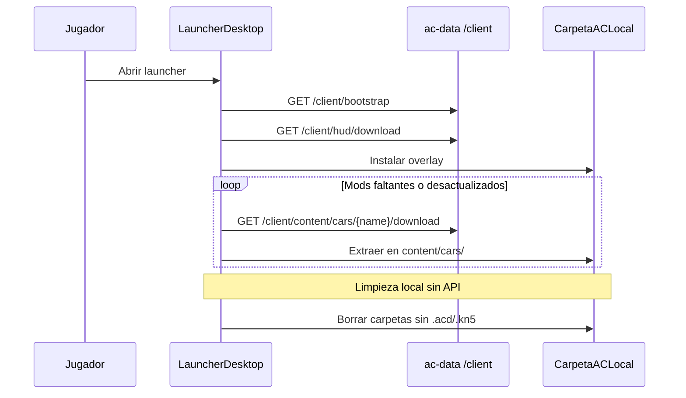

# ProjectD Launcher API

Public read API for the **ProjectD desktop launcher**. Players download the HUD overlay and Assetto Corsa content (cars/tracks) from your VPS without authentication.

Server-side empty-mod cleanup stays in the **admin panel** (`DELETE /admin/content/empty`). The launcher removes empty local folders on the user's PC only.

## Authentication

**Default: no API key.** All `GET /client/*` routes are public, protected by rate limits per IP.

Optional legacy lock (staging): set `CLIENT_LAUNCHER_REQUIRE_API_KEY=true` and `CLIENT_SYNC_API_KEY` — then pass `x-api-key` on every request.

## Rate limits

| Scope | Env | Default |
|-------|-----|---------|
| General GET (`/bootstrap`, `/hud/latest`, `/content/manifest`) | `CLIENT_LAUNCHER_RATE_LIMIT_MAX` | 60 / min / IP |
| ZIP downloads (`*/download*`) | `CLIENT_LAUNCHER_DOWNLOAD_RATE_LIMIT_MAX` | 10 / min / IP |

## Bootstrap (recommended)

Single call when the launcher opens:

| Method | Path | Description |
|--------|------|-------------|
| GET | `/client/bootstrap` | HUD latest + full cars/tracks manifests |

```json
{
  "ok": true,
  "hud": { "version", "filename", "size", "sha256", "uploadedAt" },
  "cars": { "count": 12, "items": [...] },
  "tracks": { "count": 8, "items": [...] }
}
```

`hud` is `null` if no release uploaded yet.

## HUD overlay

| Method | Path | Description |
|--------|------|-------------|
| GET | `/client/hud/latest` | Latest release metadata |
| GET | `/client/hud/download` | Download latest ZIP |
| GET | `/client/hud/download/:filename` | Download specific release |

Upload releases: admin tab **ProjectD HUD** or `POST /admin/hud/releases`.

## Content (cars / tracks)

| Method | Path | Description |
|--------|------|-------------|
| GET | `/client/content/manifest?type=cars` | Manifest with `isEmpty`, `hasAcd`, `hasKn5`, sizes |
| GET | `/client/content/:type/:name/download` | ZIP of mod folder or file |

**Empty mod** (for local cleanup): no `.acd` and no `.kn5` anywhere under the mod folder. The launcher should scan the user's AC `content/cars` and `content/tracks` locally and delete empty folders — **do not** call DELETE on the server.

## Launcher flow



## Examples

```bash
export BASE=http://localhost:3000

# Bootstrap (no auth)
curl -s "$BASE/client/bootstrap"

# HUD
curl -s "$BASE/client/hud/latest"
curl -L "$BASE/client/hud/download" -o projectd-hud.zip

# Content
curl -s "$BASE/client/content/manifest?type=cars"
curl -L "$BASE/client/content/cars/ks_toyota_gt86/download" -o gt86.zip
```

## Admin (operators only)

| Action | Endpoint |
|--------|----------|
| Upload HUD ZIP | Admin → ProjectD HUD |
| Clean empty mods on VPS | Cars/Tracks → **Clean empty** or `DELETE /admin/content/empty?type=cars` |

## Env

```bash
PROJECTD_HUD_PATH=/path/to/projectd-hud
CLIENT_LAUNCHER_RATE_LIMIT_MAX=60
CLIENT_LAUNCHER_DOWNLOAD_RATE_LIMIT_MAX=10
CLIENT_LAUNCHER_CORS_ORIGIN=*
CLIENT_LAUNCHER_REQUIRE_API_KEY=false
# CLIENT_SYNC_API_KEY=...   # only if REQUIRE_API_KEY=true
```

## Verification

```bash
curl -s http://localhost:3000/client/bootstrap
curl -s http://localhost:3000/client/hud/latest
# DELETE /client/content/empty should 404 (removed)
cd ac-data && npm run build && npm test
```
