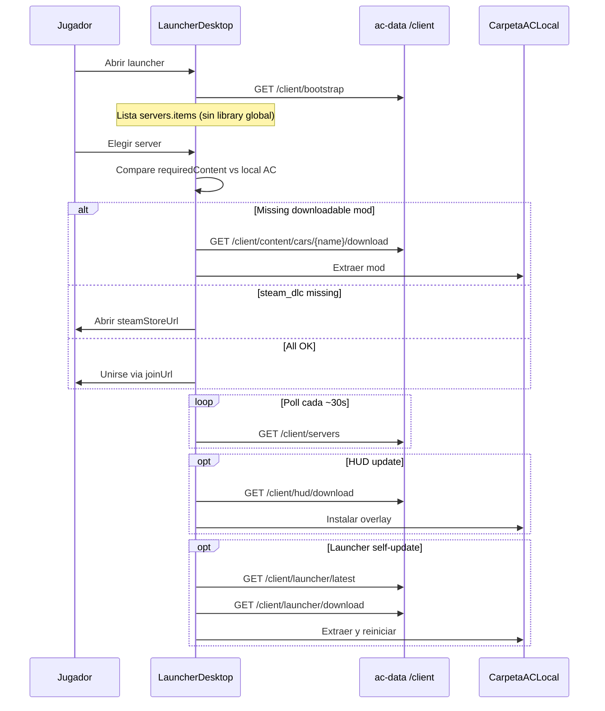

# ProjectD Launcher API

Public read API for the **ProjectD desktop launcher**. Players install the HUD overlay and download **only the mods required by the server they choose** — no full asset library sync.

Server-side empty-mod cleanup stays in the **admin panel** (`DELETE /admin/content/empty`). The launcher removes empty local folders on the user's PC only.

## Authentication

**Default: no API key.** All `GET /client/*` routes are public, protected by rate limits per IP.

Optional legacy lock (staging): set `CLIENT_LAUNCHER_REQUIRE_API_KEY=true` and `CLIENT_SYNC_API_KEY` — then pass `x-api-key` on every request.

## Rate limits

| Scope | Env | Default |
|-------|-----|---------|
| General GET (`/bootstrap`, `/servers`, `/hud/latest`) | `CLIENT_LAUNCHER_RATE_LIMIT_MAX` | 60 / min / IP |
| ZIP downloads (`*/download*`) | `CLIENT_LAUNCHER_DOWNLOAD_RATE_LIMIT_MAX` | 10 / min / IP |

## Bootstrap (lite)

Single call when the launcher opens — **no global cars/tracks manifest**:

| Method | Path | Description |
|--------|------|-------------|
| GET | `/client/bootstrap` | HUD latest + active servers with per-server `requiredContent` |

```json
{
  "ok": true,
  "hud": { "version", "filename", "size", "sha256", "uploadedAt" },
  "launcher": {
    "latest": { "version", "filename", "size", "sha256", "uploadedAt", "platform": "windows" },
    "minHudVersion": null
  },
  "servers": {
    "count": 1,
    "items": [{
      "serverName": "server",
      "displayName": "ProjectD #1",
      "type": "unified",
      "track": "pk_akina",
      "trackConfig": "",
      "cars": ["ks_toyota_gt86"],
      "httpPort": 8081,
      "joinUrl": "https://acstuff.club/s/q:race/online/join?ip=…&httpPort=8081",
      "requiredContent": {
        "cars": [{ "name", "modifiedAt", "distribution", "downloadable", "steamStoreUrl", "displayName", "zipSizeBytes" }],
        "track": { "...": "..." }
      }
    }]
  }
}
```

`hud` is `null` if no release uploaded yet.

| Field | Meaning |
|-------|---------|
| `launcher.latest` | Latest desktop launcher release metadata, or `null` if none uploaded |
| `launcher.minHudVersion` | Reserved; `null` until a minimum HUD version is enforced |

**Removed from bootstrap (breaking change):** `cars`, `tracks`, `launcher.contentVersion`. The launcher no longer syncs a full mod library on open.

## Active servers (joinable now)

Only servers that are **Convex `isActive`** (per pool rules) **and** have a running `acServer` process on this VPS are listed.

| Method | Path | Description |
|--------|------|-------------|
| GET | `/client/servers` | Same `servers` block as bootstrap — poll every 15–30s |

Each item (`LauncherServerEntry`):

| Field | Meaning |
|-------|---------|
| `serverName` | Folder slug (`server`, `server-1`, …) |
| `displayName` | Public server name from INI |
| `type` | Mode from Convex (`unified`, `battle`, `time-attack`, …) |
| `track` | Track id (`TRACK` in server_cfg.ini) |
| `trackConfig` | Layout (`CONFIG_TRACK`) |
| `cars` | Required car ids (semicolon list from INI) |
| `httpPort` | HTTP port for Content Manager join |
| `udpPort` | UDP game port (informational) |
| `maxClients` | Server capacity |
| `playerCount` | Players online (from latest `server_status` telemetry) |
| `hasPassword` | Whether a password is set (password is never exposed) |
| `joinUrl` | Content Manager deep link |
| `isRunning` | Always `true` in this list |
| `requiredContent.cars` | Full `LauncherContentEntry[]` for each car on this server |
| `requiredContent.track` | Full `LauncherContentEntry` for the track, or `null` |

**Join URL host:** set `LAUNCHER_AC_HOST` to the **public game VPS IP or hostname** (not the API domain). If unset, no servers are exposed.

**Mod on INI but missing on VPS:** entry appears with `downloadable: false` and `modifiedAt` epoch — show “mod not available” in UI.

## HUD overlay

| Method | Path | Description |
|--------|------|-------------|
| GET | `/client/hud/latest` | Latest release metadata |
| GET | `/client/hud/download` | Download latest ZIP |
| GET | `/client/hud/download/:filename` | Download specific release |

Upload releases: admin tab **ProjectD HUD** or `POST /admin/hud/releases`.

**ZIP download caching:** HUD and content download endpoints always respond **200 with a full ZIP body**. They set `Cache-Control: no-store` and do not emit ETags — clients that send `If-None-Match` still receive the file (never HTTP 304).

## Launcher app (desktop)

Windows portable ZIP for first-time download (website) and in-app auto-update.

| Method | Path | Description |
|--------|------|-------------|
| GET | `/client/launcher/latest` | Latest release metadata |
| GET | `/client/launcher/download` | Download latest ZIP |
| GET | `/client/launcher/download/:filename` | Download specific release |

Upload releases: admin tab **ProjectD Launcher** or `POST /admin/launcher/releases`.

Example metadata:

```json
{
  "ok": true,
  "version": "1.0.0",
  "filename": "projectd-launcher-v1.0.0.zip",
  "size": 52428800,
  "sha256": "abc123…",
  "uploadedAt": "2026-07-28T12:00:00.000Z",
  "platform": "windows"
}
```

**Website flow:** fetch `/client/launcher/latest`, link the download button to `/client/launcher/download`.

**In-app auto-update:** on startup, compare local `sha256` with bootstrap `launcher.latest.sha256` (or call `/client/launcher/latest`); if different, download ZIP, extract, restart.

## Content downloads (on demand)

The launcher downloads mods **only when the user selects a server**, using ids from `requiredContent`.

| Method | Path | Description |
|--------|------|-------------|
| HEAD | `/client/content/:type/:name/download` | **`200 + Content-Length`** when zip cache exists; **`503 zip_building`** (+ `Retry-After`) while cache is cold |
| GET | `/client/content/:type/:name/download` | ZIP with **`Content-Length`** (**403 for Steam DLC**) |

Each `LauncherContentEntry` (in `requiredContent` or legacy manifest):

| Field | Values | Meaning |
|-------|--------|---------|
| `name` | string | Folder or file id under `content/cars` or `content/tracks` |
| `modifiedAt` | ISO string | VPS mod mtime — compare locally to detect updates |
| `distribution` | `launcher` \| `steam_dlc` | How to obtain this mod |
| `downloadable` | boolean | `false` = do not call download |
| `steamStoreUrl` | string \| null | Steam store link when `steam_dlc` |
| `displayName` | string \| null | Friendly label |
| `zipSizeBytes` | number \| null | Cached ZIP size when known |

### Legacy full manifest (operators / debug)

| Method | Path | Description |
|--------|------|-------------|
| GET | `/client/content/manifest?type=cars` | Full directory scan — **not used by launcher v1** |

**403 on DLC download:**

```json
{
  "ok": false,
  "message": "\"Toyota GT86\" is official Kunos DLC — purchase on Steam...",
  "distribution": "steam_dlc",
  "steamStoreUrl": "https://store.steampowered.com/app/440630/",
  "displayName": "Toyota GT86"
}
```

## Launcher flow (server-first)



## Examples

```bash
export BASE=https://dev-api.projectd.space

curl -s "$BASE/client/bootstrap" | jq '.servers.count'
curl -s "$BASE/client/servers" | jq '.servers.items[0].requiredContent'
curl -L "$BASE/client/hud/download" -o projectd-hud.zip
curl -L "$BASE/client/launcher/download" -o projectd-launcher.zip
curl -L "$BASE/client/content/cars/MOD_NAME/download" -o mod.zip
```

## Admin (operators only)

| Action | Endpoint |
|--------|----------|
| Upload HUD ZIP | Admin → ProjectD HUD |
| Upload launcher ZIP | Admin → ProjectD Launcher |
| Clean empty mods on VPS | Cars/Tracks → **Clean empty** or `DELETE /admin/content/empty?type=cars` |
| Full mod list | Admin content panel or `GET /client/content/manifest?type=cars` |

## Env

```bash
PROJECTD_HUD_PATH=/path/to/projectd-hud
PROJECTD_LAUNCHER_PATH=/path/to/projectd-launcher
CLIENT_LAUNCHER_RATE_LIMIT_MAX=60
CLIENT_LAUNCHER_DOWNLOAD_RATE_LIMIT_MAX=10
CLIENT_LAUNCHER_CORS_ORIGIN=*
CLIENT_LAUNCHER_REQUIRE_API_KEY=false
LAUNCHER_AC_HOST=YOUR_PUBLIC_VPS_IP
# CLIENT_SYNC_ZIP_CACHE_PATH=/var/cache/assetto/content-zips
# CLIENT_SYNC_ZIP_WARM=true
# CLIENT_SYNC_WARM_MODS=tracks:pk_akina
# CLIENT_SYNC_ZIP_LEVEL=1
# LAUNCHER_CONTENT_CATALOG_PATH=...
```

## Verification

```bash
curl -s http://localhost:3000/client/bootstrap | jq 'keys'
curl -s http://localhost:3000/client/servers | jq '.servers.items[0].requiredContent'
cd ac-data && npm run build && npm test

# Content download (Content-Length + large tracks)
./scripts/verify-client-content-download.sh http://localhost:3000 pk_akina MOD_CAR_NAME
curl -sI http://localhost:3000/client/content/tracks/pk_akina/download | grep -i content-length

# Warm zip cache after deploy (avoids 502/503 on first pk_akina download)
./scripts/warm-content-zip-cache.sh tracks:pk_akina
```

`HEAD /client/content/:type/:name/download` returns **200 + Content-Length** when the zip cache exists. On a cold cache it returns **503** `{ "reason": "zip_building" }` with `Retry-After: 30` and starts a background build — do not block the proxy for ~500 MB track zips. ac-data also pre-warms zips at startup from server `TRACK`/`CARS` and `CLIENT_SYNC_WARM_MODS`.

Expected bootstrap keys: `ok`, `hud`, `launcher`, `servers` — **not** `cars` or `tracks`.
