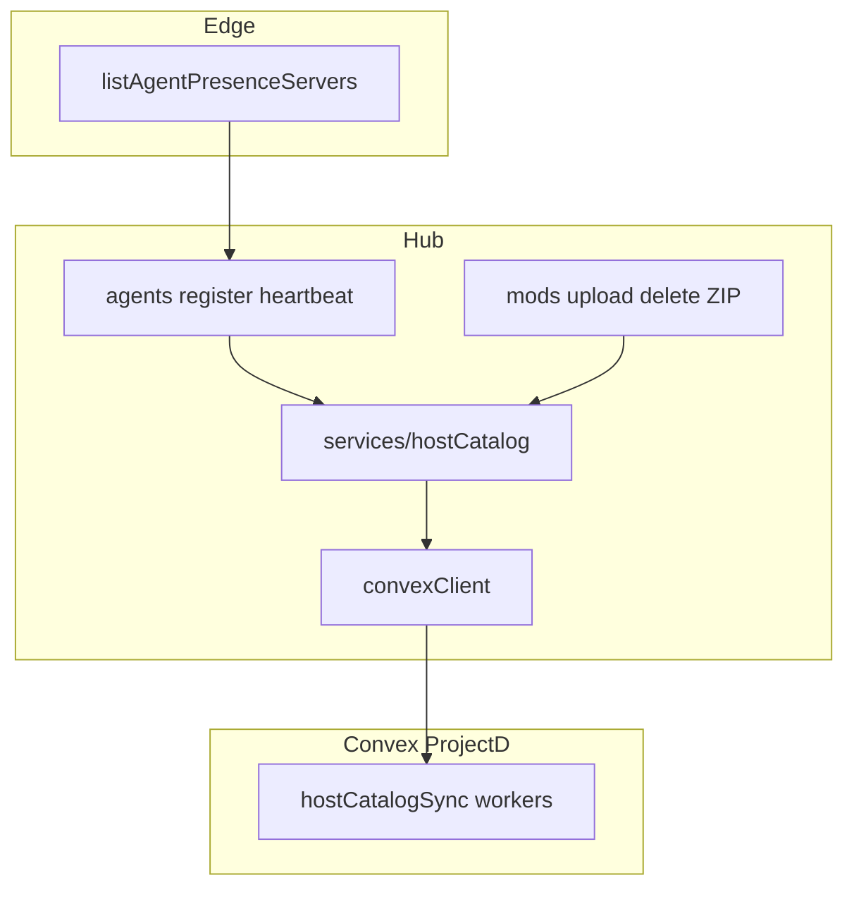

# Host catalog sync (hub → Convex)

**Source of truth** for how the hub pushes cars, tracks, and server folders into ProjectD Convex.  
Handoffs should link here instead of duplicating mutation / env detail.

MVP product flow: [examples/PROJECTD_WEB_CONVEX_HUB_HANDOFF.md](./examples/PROJECTD_WEB_CONVEX_HUB_HANDOFF.md).  
Platform overview: [SERVER_PLATFORM.md](./SERVER_PLATFORM.md).

---

## What this is

Hub module [`packages/ac-data-backend/src/services/hostCatalog/`](../packages/ac-data-backend/src/services/hostCatalog/) calls ProjectD **worker mutations** (same secret style as lap ingest) so Convex tables stay in sync with:

- Mod packages finalized / force-deleted on the hub
- Edge agent presence `servers[]` (VPS folders)

Failures are logged; they do **not** fail upload, delete, or presence.

---

## Flow

### Cars / tracks

| Hub event | Sync |
|-----------|------|
| Edge local-upload → hub `register-local` | `syncHostCatalogUpsert` → upsert car/track |
| Force delete (`orchestrator`) | `syncHostCatalogDelete` → delete car/track |

Slug = package `acContentSlug`. Skins / layouts are extracted from ZIP paths when available.

### Servers

| Hub event | Sync |
|-----------|------|
| Agent register / heartbeat with `servers[]` | `syncHostCatalogServersFromPresence` |

Edge sole source of `servers[]`: `listAgentPresenceServers` in `controlApiAgentPresence.ts` (folder names on the VPS).  
Hub only upserts/deletes Convex `servers` when the **set of folder names** changes (not every heartbeat).

---

## Env (hub)

| Variable | Default / meaning |
|----------|-------------------|
| `CONVEX_HOST_CATALOG_SYNC` | On when unset; set `false` to disable |
| `CONVEX_URL` / Convex client | Required (`isConvexConfigured`) |
| `CONVEX_WORKER_SECRET` | Required; passed as `workerSecret` on mutations |
| `CONVEX_HOST_CATALOG_UPSERT_CAR` | Override path (default below) |
| `CONVEX_HOST_CATALOG_DELETE_CAR` | … |
| `CONVEX_HOST_CATALOG_UPSERT_TRACK` | … |
| `CONVEX_HOST_CATALOG_DELETE_TRACK` | … |
| `CONVEX_HOST_CATALOG_UPSERT_SERVER` | … |
| `CONVEX_HOST_CATALOG_DELETE_SERVER` | … |

Defined in `services/hostCatalog/env.ts`.

---

## ProjectD worker contract

Implement in ProjectD: `convex/worker/hostCatalogSync.ts` (not in this repo).

Default mutation paths:

| Op | Path |
|----|------|
| Upsert car | `worker/hostCatalogSync:workerUpsertBattleCar` — `carModel`, `name`, optional `skins[]` |
| Delete car | `worker/hostCatalogSync:workerDeleteBattleCar` — `carModel` |
| Upsert track | `worker/hostCatalogSync:workerUpsertBattleTrack` — `track`, `name`, optional `configTrack[]` |
| Delete track | `worker/hostCatalogSync:workerDeleteBattleTrack` — `track` |
| Upsert server | `worker/hostCatalogSync:workerUpsertServer` — `instanceId`, `name`, `isActive` |
| Delete server | `worker/hostCatalogSync:workerDeleteServer` — `instanceId`, `name` |

All accept `workerSecret`.  
`workerUpsertServer` must resolve `vps_hosts` by `instanceId` (= edge `AC_INSTANCE_ID`).

---

## What this is **not**

- **Not** allocate / `server_slots` / Host start (phase 2 / Redis desired-config) — see [SERVER_PLATFORM.md](./SERVER_PLATFORM.md)
- **Not** treating hub `GET /v1/mods` as the Host product catalog (that is Convex `battle_*` / `servers`)
- **Not** live player presence into Convex (`LIVE_INGEST_CONVEX=false`)

ZIP ensure and mod distribute remain ops APIs; they do not replace this catalog sync.
