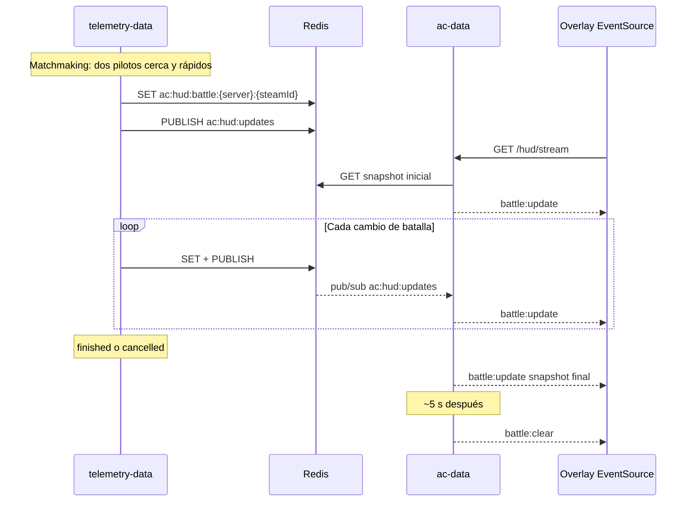

# Guía de integración: Battle HUD (SSE)

Documento para el equipo del overlay. Describe cómo consumir el stream de batallas expuesto por **ac-data**. No incluye código de referencia del cliente: solo contrato, flujo y reglas de uso.

**Flujo completo y catálogo de toasts:** ver sección [Flujo completo de batalla](#flujo-completo-de-batalla).

## Contexto

Con `BATTLE_HUD_ENABLED=true` en telemetry-data, el estado de batalla **no se envía por chat in-game**. El overlay usa **`EventSource`** contra `GET /hud/stream` (SSE unificado con time attack).

Flujo de datos:

1. telemetry-data escribe snapshots en Redis (`ac:hud:battle:*`) y publica en `ac:hud:updates`.
2. ac-data enriquece cada jugador con perfil (nombre, tier, avatar) al servir datos de batalla.
3. El overlay abre **una conexión SSE** y recibe `battle:update` / `battle:clear` en push.

No hay endpoints de poll (`/hud/battle`, `/hud/battle/version`) ni Socket.io — solo el stream SSE.

## Flujo completo de batalla

Vista de extremo a extremo: qué hace el servidor, qué llega por SSE y qué debe pintar el overlay.

### Pipeline (backend → overlay)



### Línea temporal (orden típico)

| Orden | `state` | SSE `battle:update` | Toast (`lastEvent.label`) | Qué pintar en el HUD |
|------:|---------|---------------------|---------------------------|----------------------|
| 1 | `pairing` | `player1`, `player2`, scores 0 | — | Panel visible; rival y coches |
| 2 | `arming` | + `armingCountdownSec` (5→1) | — | Número grande de cuenta atrás |
| 3 | `armed` | + `battleId` | — | “Listos” / pre-salida |
| 4 | `launching` | rival + gap | — | “GO” breve |
| 5 | `active` | + `role`, `gap3dM`, scores | `overtake`, `recover`, … al puntuar | Marcador, LEAD/CHASE, barra gap |
| 6 | `finished` o `cancelled` | + `endLabel`, `winnerSteamId` si aplica | `win`, `draw`, `cancel`, `stopped` | Resultado + toast |
| 7 | (clear) | `battle:clear` | — | Mantener latch 3–5 s; luego ocultar |

**Reglas clave:**

- Cada fase llega como **`battle:update` con snapshot completo** — reemplazar todo el estado local, no parchear campos sueltos.
- Los **toasts** son siempre **`lastEvent.label`** (una palabra en minúsculas). Dedup por `lastEvent.ts`.
- **`endLabel`** repite la misma palabra en fin/cancel; puedes usar `lastEvent.label` o `endLabel` para el toast final.
- **`pairing` → `arming` → …** no mandan toast; solo cambia `state` y campos asociados.
- Tras `finished`/`cancelled`, **`battle:clear`** ~5 s después es normal — no ocultar al instante (usar latch).

### Qué campo leer para cada parte del HUD

| Parte del overlay | Campo(s) SSE |
|-------------------|--------------|
| Toast superior | `lastEvent.label` (si `lastEvent.ts` > último mostrado) |
| Marcador yo / rival | `player1` / `player2` comparando `steamId` con el local |
| Rol LEAD / CHASE | `player.role` en `state: active` |
| Barra de separación | `gap3dM / disappearGapM` |
| Cuenta atrás ARM | `armingCountdownSec` |
| Ganador | `winnerSteamId`, `status` |
| Feed de puntos (opcional) | `pointsLog[].label` |

### Catálogo de toasts (texto en pantalla)

Palabras que verás en `lastEvent.label`, `endLabel` y `pointsLog[].label`. **No** incluyen nombres, marcador ni “+1” — caben en un toast pequeño.

**Durante `active` (puntos):**

| `reason` | Texto en HUD |
|----------|--------------|
| `overtake` | overtake |
| `position_recovery` | recover |
| `outrun` | outrun |
| `finish_outrun` | finish |
| `dnf_lead_stalled` / `dnf_chase_stalled` | stopped |

**Al cancelar (`cancelled`):**

| Situación (`cancelReason`) | Texto en HUD |
|----------------------------|--------------|
| `opponent_stalled` | stopped |
| `arming_aborted`, `prestart_gap` | cancel |
| `separated_idle`, `gap_disappeared`, disolver pareja, etc. | cancel |

**Al terminar (`finished`):**

| Resultado | Texto en HUD |
|-----------|--------------|
| Victoria (meta o abandono) | win |
| Empate en meta | draw |

**Todas las palabras posibles:** `overtake`, `recover`, `outrun`, `finish`, `stopped`, `cancel`, `win`, `draw`.

El chat in-game sigue usando frases largas (`BATTLE CANCELLED`, etc.); **el HUD no las recibe** cuando `BATTLE_HUD_ENABLED=true`.

### Ejemplos por momento (JSON mínimo)

**Emparejamiento — sin toast:**

```json
{ "state": "pairing", "player1": { "name": "Alice", "score": 0 }, "player2": { "name": "Bob", "score": 0 } }
```

**ARM — cuenta atrás, sin toast:**

```json
{ "state": "arming", "armingCountdownSec": 3, "player1": { "score": 0 }, "player2": { "score": 0 } }
```

**Punto — toast `overtake`:**

```json
{
  "state": "active",
  "player1": { "steamId": "…01", "score": 1, "role": "lead" },
  "player2": { "steamId": "…02", "score": 2, "role": "chase" },
  "lastEvent": { "reason": "overtake", "label": "overtake", "scorerSteamId": "…02", "ts": 1719061234000 },
  "gap3dM": 12.5,
  "disappearGapM": 250
}
```

**Cancel ARM — toast `cancel`:**

```json
{
  "state": "cancelled",
  "status": "cancelled",
  "cancelReason": "arming_aborted",
  "endLabel": "cancel",
  "lastEvent": { "reason": "arming_aborted", "label": "cancel", "ts": 1719061235000 }
}
```

**Victoria — toast `win`:**

```json
{
  "state": "finished",
  "status": "finished",
  "winnerSteamId": "76561199000000001",
  "endLabel": "win",
  "lastEvent": { "reason": "finish_outrun", "label": "win", "scorerSteamId": "76561199000000001", "ts": 1719061236000 }
}
```

### Cómo se ve en pantalla (referencia visual)

Toast = `lastEvent.label`. El resto del panel viene del snapshot (`state`, scores, gap).

```
┌─────────────────────────────┐
│         overtake            │  ← lastEvent.label (active)
├─────────────────────────────┤
│  YOU  1  │  2  RIVAL         │  ← scores por steamId
│  LEAD    │  CHASE             │  ← role
│  [====········] gap 12m       │  ← gap3dM / disappearGapM
└─────────────────────────────┘

┌─────────────────────────────┐
│            3                │  ← armingCountdownSec (arming)
└─────────────────────────────┘

┌─────────────────────────────┐
│            win              │  ← finished
├─────────────────────────────┤
│  YOU  3  │  2  RIVAL         │
└─────────────────────────────┘

┌─────────────────────────────┐
│          cancel             │  ← cancelled (ARM, separación)
└─────────────────────────────┘

┌─────────────────────────────┐
│         stopped             │  ← cancelled (rival parado 0-0)
└─────────────────────────────┘
```

## Base URL

| Concepto | Valor |
|----------|--------|
| Prefijo | `/hud` |
| Endpoint | `GET /hud/stream` |
| Host/puerto | Mismo servicio ac-data del entorno (dev/prod; puerto típico `3000`) |
| CORS | Habilitado (`HUD_CORS_ORIGIN`, por defecto `*`) |

Ejemplo de URL completa:

`http://{HOST}:{PORT}/hud/stream?steamId=76561199000000001&api_key=…`

## Autenticación

| Situación | Detalle |
|-----------|---------|
| Sin clave | Stream público si `HUD_API_KEY` no está definido |
| Con `api_key` en query | Obligatorio si el VPS define `HUD_API_KEY` (`EventSource` no envía headers) |

El stream SSE **no cuenta** contra el rate limit HTTP de otros endpoints `/hud/*` (time-attack).

## SSE (único transporte battle)

Push en tiempo real vía **Server-Sent Events** (`EventSource`). HTTP GET largo — mismo `connect-src` que `fetch`, sin WebSocket ni librerías.

| Concepto | Valor |
|----------|--------|
| Endpoint | `GET /hud/stream` |
| Query obligatoria | `steamId`, `api_key` (si `HUD_API_KEY` está configurada) |
| Auth opcional | `api_key` en query si `HUD_API_KEY` está definido |
| Desactivar | `HUD_SSE_ENABLED=false` en ac-data |

### Conexión (cliente nativo)

```javascript
const url = `http://HOST:3000/hud/stream?steamId=${steamId}&api_key=${apiKey}`;
const es = new EventSource(url);

es.addEventListener('session:update', (e) => {
  applySession(JSON.parse(e.data));
});

es.addEventListener('battle:update', (e) => {
  applyFullSnapshot(JSON.parse(e.data));
});

es.addEventListener('battle:clear', () => {
  startFinishLatch();
});

es.onerror = () => {
  es.close();
  setTimeout(() => { /* new EventSource(url) */ }, 3000);
};
```

### Eventos SSE

| Evento | Cuándo | Payload (`data`) |
|--------|--------|-------------------|
| `session:update` | Al conectar y tras cambio de perfil/rivals (time attack) | JSON `HudSessionVpsResponse` |
| `session:error` | Presencia inválida mid-session | `{ ok: false, reason }` |
| `battle:update` | Al conectar (si hay batalla) y en cada cambio Redis | JSON `HudBattleOk` |
| `battle:clear` | Tras `finished`/`cancelled` ~5 s, o snapshot ausente | `{"ok":false,"reason":"no_battle"}` |

Formato wire: `event: battle:update\ndata: {...}\n\n`

Comentarios `: keepalive` cada ~30 s mantienen la conexión viva tras proxies. En cada keepalive, ac-data **renueva** `ac:hud:presence:{steamId}` en Redis.

Tras `battle_finished` (Convex actualiza elo), ac-data refresca el perfil de **ambos** pilotos con steam id válido y vuelve a emitir `battle:update` para que el HUD muestre el elo nuevo en la pantalla de resultado (~800 ms delay, `HUD_BATTLE_REFRESH_DELAY_MS`).

## Parámetros de query (obligatorios)

| Parámetro | Origen | Notas |
|-----------|--------|-------|
| `steamId` | Steam GUID del jugador local | Identifica al viewer; ac-data resuelve el servidor |

**No hace falta** enviar `track`, `trackConfig`, `car`. Circuito y layout vienen en el snapshot.

## Endpoint

### `GET /hud/stream`

Stream push unificado (time attack + battle).

**Query:** `steamId`, opcional `api_key`

**200 OK** — `Content-Type: text/event-stream`; eventos `battle:update` y `battle:clear`.

**400** — falta query: `{ "error": "steamId is required" }`

**404** — presencia inválida: `{ "ok": false, "reason": "player_not_connected" | "not_managed_server" }`

**401** — `{ "error": "Unauthorized" }`

**404** — SSE deshabilitado: `{ "error": "Battle HUD SSE disabled" }`

Una conexión persistente por jugador. No usar poll paralelo.

### Ejemplo de payload `battle:update`

```json
{
  "ok": true,
  "version": "1719061234567",
  "battleId": "battle-a1b2c3d4e5f6",
  "state": "active",
  "serverName": "Battle Test",
  "track": "pk_akina",
  "trackConfig": "downhill",
  "player1": {
    "steamId": "76561199000000001",
    "name": "Alice",
    "tier": 8,
    "elo": 1540,
    "car_id": "ks_toyota_gt86",
    "car_name": "Toyota GT86",
    "score": 2,
    "role": "lead"
  },
  "player2": {
    "steamId": "76561199000000002",
    "name": "Bob",
    "tier": 5,
    "elo": 1480,
    "car_id": "ks_mazda_miata",
    "car_name": "Mazda MX-5",
    "score": 1,
    "role": "chase"
  },
  "lastEvent": {
    "reason": "overtake",
    "label": "overtake",
    "scorerSteamId": "76561199000000002",
    "ts": 1719061234000
  },
  "pointsLog": [],
  "status": "active"
}
```

## Campos del snapshot

### Metadatos

| Campo | Descripción |
|-------|-------------|
| `version` | Token de cambio en cada `battle:update` |
| `battleId` | Id estable de la partida; puede ser `null` en estados muy tempranos |
| `state` | Fase actual de la batalla (ver tabla abajo) |
| `armingCountdownSec` | Solo relevante en `arming`: segundos restantes (típicamente 5→1) |
| `serverName` | Nombre normalizado del servidor |
| `track` | Id de pista AC |
| `trackConfig` | Layout/config de pista |
| `status` | Resumen de resultado: `active`, `finished`, `draw`, `cancelled` |
| `winnerSteamId` | Steam id del ganador cuando la batalla termina |

### Jugadores (`player1`, `player2`)

Cada slot incluye:

| Campo | Uso en UI |
|-------|-----------|
| `steamId` | Identificar jugador local vs rival |
| `name` | Nombre mostrado (desde caché de perfil) |
| `tier` | Nivel/rango battle; `0` si no hay perfil |
| `elo` | ELO battle del jugador; omitido si no hay perfil. Tras `finished`, ac-data refresca perfil y re-emite `battle:update` con el elo actualizado de **ambos** pilotos |
| `avatar_url` | URL de avatar; puede omitirse |
| `car_id` | Id interno del coche en AC |
| `car_name` | Nombre legible del coche |
| `score` | Puntos acumulados en la batalla |
| `role` | `lead` o `chase`; suele aparecer en `state: active` |

**Importante:** `player1` no es necesariamente el jugador local. Hay que comparar cada `steamId` con el del usuario en sesión para saber quién es “yo” y quién es el rival.

Si falta perfil en Redis, ac-data rellena `name` con un valor por defecto y `tier` con `0` (sin `elo`), pero mantiene `car_id` / `car_name` del snapshot de batalla.

**Overlay battle:** lee `tier` y `elo` de `player1` / `player2` en cada `battle:update`.

### Eventos y marcador

| Campo | Descripción |
|-------|-------------|
| `lastEvent` | Último evento relevante: puntos en `active`, fin/cancel en `finished`/`cancelled`. Incluye `reason`, `label`, opcional `scorerSteamId`, `ts` |
| `pointsLog` | Historial cronológico de puntos; cada entrada puede tener `scorer`, `reason`, `label`, `ts` |
| `cancelReason` | Solo en `state: cancelled` — código interno (`arming_aborted`, `prestart_gap`, `opponent_stopped`, `separated_idle`, …) |
| `endReason` | Solo en `state: finished` por abandono — p. ej. `gap_disappeared`, `opponent_stalled`, `opponent_disconnected` |
| `endLabel` | Palabra corta para toast de fin/cancel (`win`, `draw`, `cancel`, `stopped`) |
| `finishGapM` | Metros de separación al cruzar meta en fin de sesión |
| `positionFallback` | `true` si la batalla usa modo posición (sin spline) |

Valores habituales de `reason` en puntos (`active`) y su `label` asociado (una palabra, pensado para toast pequeño):

| `reason` | `label` |
|----------|---------|
| `overtake` | overtake |
| `position_recovery` | recover |
| `outrun` | outrun |
| `finish_outrun` | finish |
| `draw` | draw |
| `dnf_lead_stalled` / `dnf_chase_stalled` | stopped |

Cancel / fin (`lastEvent.label` y `endLabel`):

| Situación | `label` |
|-----------|---------|
| Oponente parado (0-0) | stopped |
| ARM abort / prestart / disolver | cancel |
| Victoria por abandono o meta | win |
| Empate en meta | draw |

### Matriz evento → campos API

| Fase / evento | `state` | Campos extra |
|---------------|---------|--------------|
| Emparejamiento | `pairing` | — |
| ARM 5→1 | `arming` | `armingCountdownSec` |
| Frenar en ARM | `cancelled` | `cancelReason: arming_aborted`, `endLabel`, `lastEvent` |
| ARMED | `armed` | `battleId` |
| Abort prestart (>80 m) | `cancelled` | `cancelReason: prestart_gap`, `endLabel`, `lastEvent` |
| GO | `launching` | — |
| LEAD / CHASE | `active` | `role` en cada jugador |
| Position mode | `active` | `positionFallback: true` |
| Overtake / recover | `active` | `lastEvent`, `pointsLog`, scores |
| Fin WIN / DRAW | `finished` | `status`, `winnerSteamId`, `finishGapM`, `endLabel`, `lastEvent` |
| Abandon win | `finished` | `endReason`, `endLabel`, `lastEvent`, `winnerSteamId` |
| Cancel 0-0 | `cancelled` | `cancelReason`, `endLabel`, `lastEvent` |
| Disolver pareja | `cancelled` | `cancelReason` según motivo, `endLabel`, `lastEvent` |
| Gap en vivo | `active` | `gap3dM`, `disappearGapM` |

Tras `finished` o `cancelled`, el backend envía el snapshot final por SSE y, ~5 s después, `battle:clear`. Mantener latch cliente 3–5 s al recibir `battle:clear`.

### Separación 3D (barra de ruptura)

| Campo | Descripción |
|-------|-------------|
| `gap3dM` | Distancia 3D actual entre los dos jugadores (metros). Se actualiza durante la batalla (publicación con debounce ~300 ms). |
| `disappearGapM` | Umbral de abandono por separación (default **250**, env `BATTLE_DISAPPEAR_GAP_METERS`). |

**Barra en el HUD:** `progreso = gap3dM / disappearGapM` (0 = juntos, 1 = riesgo de fin de batalla). Mostrar sobre todo en `state: active`.

**Importante:** al llegar a `disappearGapM` no siempre pierde quien va detrás; el servidor resuelve abandono según velocidad y quién va adelante en pista. La barra indica **riesgo de ruptura**, no derrota automática del local.

## Estados (`state`) y qué mostrar

| `state` | Significado | Sugerencia UI |
|---------|-------------|---------------|
| `pairing` | Buscando o confirmando rival | Mensaje “Emparejando…” |
| `arming` | Cuenta atrás pre-salida | Mostrar `armingCountdownSec` |
| `armed` | Ambos listos, esperando lanzamiento | “ARMED” / preparados |
| `launching` | Salida en curso | “GO!” breve |
| `active` | Batalla en juego | Marcador, roles LEAD/CHASE, feed de eventos, **barra `gap3dM` / `disappearGapM`** |
| `finished` | Terminada con resultado | Marcador final, `winnerSteamId`; toast **`lastEvent.label`** (`win` / `draw`) |
| `cancelled` | Cancelada | Toast **`lastEvent.label`** (`cancel` / `stopped`); latch ~5 s |
| `none` | Sin fase reconocible | Tratar como idle / ocultar overlay |

## Flujo SSE recomendado

1. Obtener `steamId` del jugador local (Steam GUID).
2. Abrir `EventSource` a `/hud/stream?steamId=…` al entrar al servidor.
3. En cada `battle:update`: reemplazar snapshot entero y pintar UI.
4. En `battle:clear`: activar latch 3–5 s con último snapshot, luego ocultar overlay.
5. En `onerror`: cerrar y reconectar tras 2–3 s (no abrir múltiples streams en paralelo).

## Diferencias respecto a time-attack

| Aspecto | Time-attack | Battle |
|---------|-------------|--------|
| Transporte | Poll HTTP | **SSE (`EventSource`)** |
| Versión time attack | Campo `version` en `session:update` | Campo `version` en `battle:update` |
| Datos battle | — | Eventos `battle:update` |
| Datos perfil/rivals | Eventos `session:update` | — |
| Query extra | `steamIds`, filtros opcionales | Solo `steamId` (+ `api_key`) |
| Chat | N/A | Sin mensajes de batalla por chat si HUD activo |

## Sincronización y anti-desync (obligatorio en el cliente)

El overlay debe tratar cada `battle:update` como **única fuente de verdad**. No mezclar chat in-game ni estado local.

### Regla de oro

**Toda la UI de batalla se pinta desde el último snapshot completo.**

### Estado local mínimo

| Variable | Uso |
|----------|-----|
| `snapshot` | Último JSON de `battle:update` |
| `lastEventTs` | Último `lastEvent.ts` mostrado (evita toast duplicado) |
| `finishLatchUntil` | Timestamp (ms) hasta el que se sigue mostrando fin/cancel |
| `finishLatchSnapshot` | Copia del snapshot en `finished` / `cancelled` |

### Algoritmo (SSE)

1. `EventSource` conectado a `/hud/stream`.
2. `battle:update` → reemplazar `snapshot` → pintar UI.
3. Si `state === finished|cancelled` → guardar latch 4 s.
4. `battle:clear` → si latch activo, seguir mostrando; si no, ocultar HUD.
5. `onerror` → reconectar un solo stream (evitar duplicados).

### Cuándo mostrar cada fase (no omitir estados)

| `state` | Qué debe verse en pantalla |
|---------|----------------------------|
| `pairing` | Panel de batalla visible (“Emparejando…”) |
| `arming` | Countdown `armingCountdownSec` |
| `armed` / `launching` | Pre-salida / GO |
| `active` | Marcador (`player1.score` / `player2.score`), roles, barra gap, toast en `lastEvent` |
| `finished` | Ganador (`winnerSteamId`), scores finales → toast `win` o `draw` → **activar latch 3–5 s** |
| `cancelled` | Toast `cancel` o `stopped`, scores si los hay → **activar latch 3–5 s** |

**Error frecuente:** ocultar el HUD al primer `battle:clear` sin latch — el usuario no ve fin/cancel.

### Latch de fin (crítico)

Al recibir snapshot con `state === "finished"` o `"cancelled"` (o en `battle:clear`):

1. Guardar copia en `finishLatchSnapshot`.
2. `finishLatchUntil = Date.now() + 4000`.
3. Seguir pintando hasta expirar el latch.
4. Luego ocultar overlay y cerrar/reabrir `EventSource` si hace falta.

### Puntos y toasts

- **Marcador:** siempre `me.score` y `rival.score` del snapshot (resolver `me` por `steamId`).
- **Toast arriba:** al aplicar snapshot, si `lastEvent` existe y `lastEvent.ts > lastEventTs` → mostrar `lastEvent.label` y actualizar `lastEventTs`.
- **Feed:** opcional desde `pointsLog`; no reconstruir solo desde toasts.
- **No** esperar chat: con `BATTLE_HUD_ENABLED=true` no hay mensajes de batalla in-game.

### Nueva batalla

Si `battleId` del snapshot cambia respecto al anterior:

- Resetear `lastEventTs`, latch y toasts.
- Evita mostrar puntos de la partida anterior en la nueva.

### Barra de separación

- Usar `gap3dM` y `disappearGapM` del snapshot.
- No calcular distancia en el cliente.
- Cada `battle:update` trae datos frescos; no hace falta poll.

### Diagrama de flujo

```
EventSource /hud/stream
  ├─ battle:update → reemplazar snapshot → pintar UI
  │    ├─ state finished/cancelled → iniciar latch
  │    └─ lastEvent.ts nuevo → toast
  ├─ battle:clear → latch activo ? mantener : ocultar HUD
  └─ onerror → reconectar (un solo stream)
```

## Troubleshooting: el HUD no muestra nada o va desincronizado

### Síntoma: no aparece batalla, puntos, cancelación ni fin

Comprobar en este orden:

**1. ¿Llega data del backend?**

```bash
./scripts/verify-battle-hud.sh "NOMBRE_SERVIDOR" TU_STEAM_ID
```

Debe conectar al stream SSE (keepalive o evento `battle:update` si hay batalla).

**2. `steamId` correcto**

- `steamId` = Steam GUID del jugador local.
- ac-data descubre el servidor desde presencia telemetry; no hace falta enviar `serverName`.
- Mismo `api_key` que en el resto del HUD (`HUD_API_KEY` en ac-data).
- Error típico: jugar en servidor `testing` pero el HUD envía `Projectd Battle` → siempre `no_battle`.

**3. ¿EventSource conectado?**

- Un solo `EventSource` por sesión (no abrir varios en paralelo).
- Reconectar en `onerror` con backoff; no mezclar con poll HTTP (endpoints eliminados).

**4. ¿Solo se muestra `active`?**

- Implementar UI para `pairing`, `arming`, `armed`, `launching`, **`finished`**, **`cancelled`**.
- Sin latch en `finished`/`cancelled`, la pantalla desaparece antes de que el usuario vea resultado o cancelación.

**5. ¿Se oculta el HUD al primer `battle:clear`?**

- Tras terminar, `battle:clear` es **normal** ~5 s después del snapshot final.
- No ocultar de inmediato si hay latch de fin activo.

**6. ¿URL / CORS / CSP?**

- Confirmar que el overlay apunta al **mismo host:puerto** que ac-data (no `localhost` en un PC remoto si ac-data está en el VPS).
- Probar la URL en el navegador de esa PC o con curl.
- Firewall o antivirus bloqueando HTTP local.

**7. ¿Servidor en modo battle?**

- telemetry-data solo publica HUD en servidores con modo `battle` en Convex → Redis `ac:config`.
- Si el servidor es `time-attack`, puede no haber snapshot de batalla (salvo entornos de prueba).

### Síntoma: score/toast desfasado

- Verificar que cada `battle:update` reemplaza el snapshot entero.
- No mezclar chat ni incrementar score a mano.

### Síntoma: funciona en un PC y en otro no

- URL distinta (`localhost` vs IP VPS).
- Jugador no conectado a servidor gestionado → 404 `player_not_connected`.
- CSP bloqueando `connect-src` al host de ac-data.
- Varios `EventSource` duplicados.

### Depuración rápida

Loguear: URL del stream, cada evento SSE (`battle:update` / `battle:clear`), `state`, scores, latch.

## Checklist de implementación

1. Abrir `EventSource` a `/hud/stream` (no poll REST).
2. Aplicar `session:update` completo para perfil/rivals/time attack.
3. Aplicar snapshot battle completo en cada `battle:update`.
4. Resolver jugador local por `steamId`, no por `player1`/`player2`.
5. Mapear todos los `state` (`pairing` … `cancelled`).
6. Toasts con `lastEvent.label`; dedup por `lastEvent.ts`.
7. Latch 3–5 s en `finished`/`cancelled` y al recibir `battle:clear`.
8. Reconectar un solo stream en `onerror`.

## Verificación manual (backend)

```bash
./scripts/verify-battle-hud.sh "Battle Test" YOUR_STEAM_ID
```

## Referencias internas (backend)

- Contrato de tipos: `ac-data/src/services/hud/hudTypes.ts`
- Rutas HTTP: `ac-data/src/routes/hudRoutes.ts`
- Reglas de juego: `telemetry-data/docs/BATTLE_MODE.md`
- Claves Redis: `telemetry-data/REDIS_CONTRACT.md`
