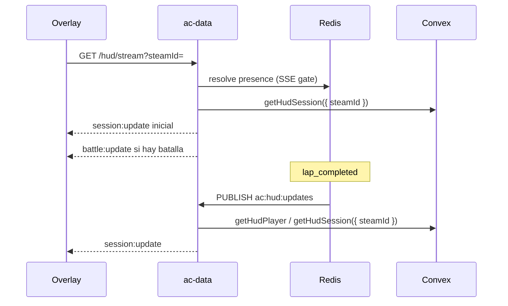

# Guía de integración: Time Attack HUD (perfil + rivals)

Documento para el equipo del overlay. Transporte **SSE único** vía ac-data (`GET /hud/stream`). Perfil Convex con **rivals** (sin top-10 ni leaderboard).

## Cambios respecto al overlay antiguo

| Antes | Ahora |
|-------|-------|
| `GET /hud/top10` | **Eliminado** |
| Poll `GET /hud/version` + `GET /hud/session` | **Eliminado** — un solo `EventSource` |
| `profile.rival` (singular) | `profile.rivals.above` / `profile.rivals.below` (Convex). ac-data añade `rival = rivals.above` en el SSE para overlays legacy. |
| Query `serverName` + `track` | **Solo `steamId`** — overlay y worker; Convex resuelve sesión activa |

**Tier vs rank:** `rank` es posición en el leaderboard del servidor; `tier` es nivel del combo pista+layout+coche vs el WR global (`verifiedRecords`). No son intercambiables.

**Contrato Convex (worker):** ac-data llama `getHudPlayer({ steamId, workerSecret })` y `getHudSession({ steamId, workerSecret })`. Convex resuelve servidor, pista, layout, coche y combo desde `live_players`. El overlay **solo** envía `steamId`.

## Flujo de datos



1. telemetry-data publica `lap_completed` y presencia en Redis.
2. ac-data refresca caché y publica `board:` / `player:` en `ac:hud:updates`.
3. El overlay abre **un** `EventSource` y aplica cada `session:update`.

## `GET /hud/stream`

Query: `steamId`, `api_key?` (si `HUD_API_KEY` está definida)

Base URL: `http://HOST:3000/hud/stream`

### Eventos SSE

| Evento | Payload |
|--------|---------|
| `session:update` | `{ ok: true, version, players[] }` — perfil + rivals + context |
| `session:error` | `{ ok: false, reason }` — presencia inválida |
| `battle:update` / `battle:clear` | Ver [HUD_BATTLE_INTEGRATION.md](./HUD_BATTLE_INTEGRATION.md) |

### Cliente

```javascript
const url = `http://HOST:3000/hud/stream?steamId=${steamId}&api_key=${apiKey}`;
const es = new EventSource(url);

es.addEventListener('session:update', (e) => {
  const data = JSON.parse(e.data);
  // data.players[0].profile — tier, best_lap_ms, rivals.above/below
  applySession(data);
});

es.addEventListener('session:error', (e) => {
  handlePresenceError(JSON.parse(e.data));
});

es.addEventListener('battle:update', (e) => {
  applyBattle(JSON.parse(e.data));
});

es.onerror = () => {
  es.close();
  setTimeout(() => { /* reconectar */ }, 3000);
};
```

Reemplazar estado local completo en cada `session:update`.

### Shape `session:update`

```json
{
  "ok": true,
  "version": "boardVer:playerVer",
  "players": [
    {
      "steamId": "76561199000000001",
      "ok": true,
      "context": {
        "server_name": "ProjectD",
        "track_id": "pk_akina",
        "layout_id": "akina_downhill",
        "car_id": "ae86",
        "car_name": "Trueno AE86",
        "player_steam_id": "76561199000000001"
      },
      "profile": {
        "name": "Alice",
        "rank": 84,
        "tier": 7,
        "best_lap_ms": 275432,
        "car_name": "Trueno AE86",
        "car_id": "ae86",
        "steam_id": "76561199000000001",
        "elo": 1520,
        "isInvalidated": false,
        "avatar_url": "https://…",
        "rivals": {
          "above": { "rank": 83, "name": "Bob", "tier": 7, "lap_ms": 275100, "car_name": "RX-7" },
          "below": { "rank": 85, "name": "Carol", "tier": 6, "lap_ms": 276000, "car_name": "Miata" }
        },
        "rival": { "rank": 83, "name": "Bob", "tier": 7, "lap_ms": 275100, "car_name": "RX-7" }
      }
    }
  ]
}
```

- `rivals.above`: rank mejor; `null` si rank 1.
- `rivals.below`: rank peor; `null` si último del board.
- `profile.tier` y `profile.best_lap_ms` van **siempre** en el JSON SSE (número; `0` si no hay dato/WR).
- ac-data normaliza campos Convex (`bestLapMs` → `best_lap_ms`) y fusiona `getHudPlayer` + `getHudSession` antes del push.
- Convex solo envía `rivals`. ac-data duplica `rivals.above` en `profile.rival` en cada `session:update` (compatibilidad con overlays que aún leen el campo singular).
- Overlays nuevos: usar solo `rivals.above` / `rivals.below`.
- `session:error` con `reason: user_invalidated` → ocultar perfil (equivalente 403).

## Actualización automática

| Evento telemetry | Push SSE |
|------------------|----------|
| `lap_completed` | `board:` bump → `session:update` (rivals). Si PB → refresh perfil → otro `session:update`. |
| `battle_finished` | Refresh elo + `battle:update` + `session:update` |

Delays: `HUD_LAP_REFRESH_DELAY_MS` (400), `HUD_BATTLE_REFRESH_DELAY_MS` (800), debounce `HUD_LAP_REFRESH_DEBOUNCE_MS` (1500).

## Errores de presencia

| `reason` | Significado |
|----------|-------------|
| `player_not_connected` | Sin presencia Redis/SSE **o** no está en `live_players` en Convex (worker debe enviar `player_join` / `server_status`) |
| `not_managed_server` | Lobby no gestionado (no ProjectD en config) |

Presencia se renueva en `server_status`, `player_join`, keepalive SSE (~30 s).

## Variables de entorno (ac-data)

| Variable | Descripción |
|----------|-------------|
| `CONVEX_HUD_PLAYER_QUERY` | Query Convex player |
| `CONVEX_HUD_SESSION_QUERY` | Query Convex session |
| `HUD_SSE_ENABLED` | SSE `/hud/stream` (default true) |
| `HUD_SSE_KEEPALIVE_MS` | Keepalive SSE (default 30000) |
| `HUD_PRESENCE_TTL_SEC` | TTL presencia (default 180s) |
| `HUD_PRESENCE_JOIN_TTL_SEC` | TTL al join (default 600s) |
| `HUD_PLAYER_TTL_SEC` / `HUD_SESSION_TTL_SEC` | TTL caché Redis |

## Relacionado

- Battle HUD: [HUD_BATTLE_INTEGRATION.md](./HUD_BATTLE_INTEGRATION.md)
- Arquitectura: [../AGENTS.md](../AGENTS.md)
