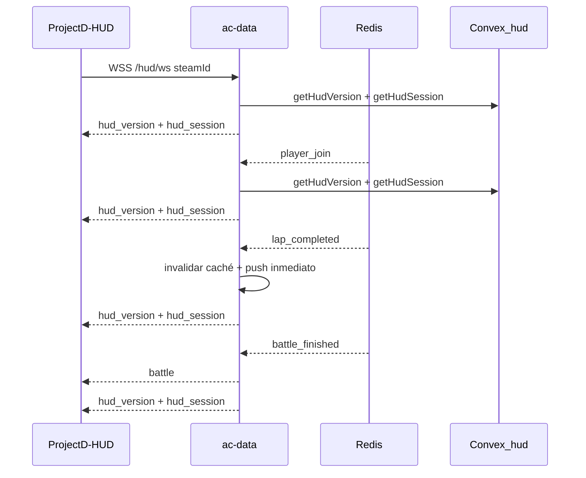

# Guía de integración: Time Attack HUD (perfil + rivals)

Documento para el equipo del overlay (ProjectD-HUD Lua). Transporte principal: **WebSocket WSS** vía ac-data (`GET /hud/ws`, CSP `web.socket`). Si WSS cae, el overlay usa **`GET /hud/snapshot`** como fallback one-shot. ac-data consulta Convex con `workerSecret` y empuja JSON al cliente in-game. **No hay rutas HTTP `/hud/version`, `/hud/session` ni `/hud/player`.**

## Cambios respecto al overlay antiguo

| Antes | Ahora |
|-------|-------|
| `GET /hud/top10` | **Eliminado** |
| Poll HTTP `/hud/version` + `/hud/session` | **Eliminado** — ac-data empuja por WSS; fallback **`GET /hud/snapshot`** cuando WSS está caído |
| `session:update` / `battle:update` | `hud_session` / `hud_version` / `hud_error` / `battle` |
| Query `serverName` + `track` | **Solo `steamId`** — Convex resuelve sesión activa desde `live_players` |
| `profile.rival` (singular) | `profile.rivals.above` / `profile.rivals.below` |

**Tier vs rank:** `rank` es posición en el leaderboard del servidor; `tier` es nivel del combo pista+layout+coche vs el WR global (`verifiedRecords`). No son intercambiables.

**Contrato Convex (worker):** ac-data llama `getHudVersion`, `getHudSession` (y opcionalmente caché corta interna). El overlay **solo** abre WSS con `steamId`.

## Flujo de datos


```mermaid
sequenceDiagram
  participant Lua as ProjectD-HUD
  participant AcData as ac-data
  participant Redis as Redis
  participant Convex as Convex_hud

  Lua->>AcData: WSS /hud/ws steamId
  AcData->>Convex: getHudVersion + getHudSession
  AcData-->>Lua: hud_version + hud_session
  Redis-->>AcData: player_join
  AcData->>Convex: getHudVersion + getHudSession
  AcData-->>Lua: hud_version + hud_session
  Redis-->>AcData: lap_completed
  AcData->>AcData: invalidar caché + push inmediato
  AcData-->>Lua: hud_version + hud_session
  Redis-->>AcData: battle_finished
  AcData-->>Lua: battle
  AcData-->>Lua: hud_version + hud_session
```

1. telemetry-data publica `lap_completed`, batallas y presencia en Redis.
2. Al conectar WSS, ac-data empuja snapshot inicial (`battle` → `hud_version` + `hud_session`).
3. Tras `player_join`, `lap_completed` o `battle_finished`, ac-data invalida/refresca caché y empuja `hud_version` + `hud_session` (sin poll periódico).

## `GET /hud/ws` (WebSocket)

Query: `steamId`, `carFilter?`, `carModel?`, `api_key?` (header `X-API-Key` también válido)

Base URL: `wss://HOST/hud/ws`

### Frames JSON

Cada mensaje: `{ "event": "<name>", "data": { ... } }`

| Evento | Cuándo | Payload |
|--------|--------|---------|
| `hud_version` | Al conectar WSS, `player_join`, `lap_completed`, `battle_finished` | `{ steamId, version, lbVersion, playerVersion }` |
| `hud_session` | Mismo trigger que `hud_version` | Respuesta `getHudSession` + `steamId` en raíz |
| `hud_error` | Error persistente (`player_not_connected`, `user_not_found`, `user_invalidated`, …) | `{ steamId, reason }` |
| `battle` | `battle_update` / `battle_finished` en Redis | Snapshot batalla (ver [HUD_BATTLE_INTEGRATION.md](./HUD_BATTLE_INTEGRATION.md)) |

Legacy `GET /hud/stream` (SSE) fue eliminado; usar WSS o snapshot fallback.

## `GET /hud/snapshot` (fallback CSP)

Query: `steamId`, `carFilter?`, `carModel?`, `api_key?` (misma auth/presencia que `/hud/stream`)

Base URL: `http://HOST:3000/hud/snapshot`

Respuesta **JSON one-shot** (no SSE). Útil cuando el overlay no puede hacer SSE incremental (`web.get` CSP 0.2.x bufferiza hasta cerrar, o HTTPS sin módulo `ssl`/`luasec`).

```json
{
  "ok": true,
  "steamId": "7656119…",
  "version": { "steamId": "…", "version": "…", "lbVersion": "…", "playerVersion": 123 },
  "session": {
    "steamId": "…",
    "ok": true,
    "version": "…",
    "context": { "…": "…" },
    "profile": { "rank": 1, "tier": 7, "rivals": { "above": null, "below": { "…": "…" } } }
  },
  "battle": {
    "ok": true,
    "state": "arming",
    "battleId": "battle-a1b2c3d4e5f6",
    "player1": { "…": "…" },
    "player2": { "…": "…" }
  }
}
```

Si no hay batalla activa: `"battle": { "ok": false, "reason": "no_battle" }` (mismo payload que SSE `battle:clear`).

Errores: `{ "ok": false, "reason": "player_not_connected" }` con HTTP **404** (igual que stream).

**ProjectD-HUD:** poll cada `HUD_SNAPSHOT_POLL_SEC` (default 5 s; **2 s** durante batalla activa via `HUD_SNAPSHOT_BATTLE_POLL_SEC`) vía `web_queue.get`. Aplica `session` + `battle` del JSON. Debug: `mode=poll bundle=y battle=y battle_state=arming`.

Verificación:

```bash
curl -s "https://dev-api.projectd.space/hud/snapshot?steamId=76561199230780195" | head -c 500
./scripts/verify-hud-overlay-contract.sh 76561199230780195
```

### Shape `hud_session`

```json
{
  "steamId": "7656119…",
  "ok": true,
  "version": "serverId:track:layout:…",
  "context": { "server_name": "testing xd", "track_id": "pk_akina", "…": "…" },
  "profile": {
    "rank": 84,
    "tier": 7,
    "best_lap_ms": 275432,
    "rivals": { "above": { "…": "…" }, "below": { "…": "…" } }
  }
}
```

- `rivals.above`: rank mejor; `null` si rank 1 (eres #1 — no hay rival arriba en el board car-scoped).
- `rivals.below`: rank peor; `null` si último del board.
- `profile.tier`, `profile.best_lap_ms` van en el JSON SSE (milisegundos).
- Usar solo `getHudSession` — no hay merge con `getHudPlayer` en el path SSE.
- `hud_error` con `reason: user_invalidated` → ocultar perfil y **expulsar del servidor** (telemetry-data comprueba `ac:user:invalidated:{steamId}` en Redis al conectar y escucha pub/sub `ac:user:invalidated` para kick en todos los servidores). El overlay recibe el SSE vía `POST /hud/worker/refresh-user` (Convex → ac-data) o en el próximo `player_join` / `lap_completed`.
- Ban + caché HUD al join: una query Convex `getPlayerJoinContext` (`CONVEX_PLAYER_JOIN_QUERY`) — ver [`docs/CONVEX_PLAYER_JOIN_CONTEXT.md`](CONVEX_PLAYER_JOIN_CONTEXT.md).

## Actualización automática

| Evento telemetry | Push SSE |
|------------------|----------|
| `player_join` | Invalida caché + `hud_version` + `hud_session` |
| `lap_completed` (PB) | Convex schedules `refresh-user` (`lap_pb` / `rival_pb`); ac-data does **not** refresh session by default (`HUD_LAP_AC_DATA_REFRESH_ENABLED=false`) |
| `lap_completed` (no PB) | Solo `last_lap_ms` en caché Redis local |
| `battle_finished` | `battle` + `hud_version` + `hud_session` para ambos jugadores |

**PB vs no-PB:** ac-data compara `lapTime` con el `best_lap_ms` en caché (`isLapPersonalBest`). Si minty repite su PB (ej. 4:41 otra vez), prox y el resto de rivales **no** reciben `hud_session`. El fingerprint de sesión (`rank` + `rivals.above/below.lap_ms`) evita pushes SSE redundantes.

Delays refresh debounced (solo vueltas PB): `HUD_LAP_REFRESH_DELAY_MS` (800), `HUD_BATTLE_REFRESH_DELAY_MS` (400), debounce `HUD_LAP_REFRESH_DEBOUNCE_MS` (1500). Para pruebas locales más rápidas: `HUD_LAP_REFRESH_DEBOUNCE_MS=400` y `HUD_LAP_REFRESH_DELAY_MS=300`.

Diagnóstico en VPS: `./scripts/verify-hud-lap-pipeline.sh [steamId]`

Si rivals siguen mal tras una vuelta: `./scripts/verify-convex-hud-session.sh [steamId]` — confirma `getHudSession` en Convex.

## Errores de presencia

| `reason` | Significado |
|----------|-------------|
| `player_not_connected` | **404 al abrir SSE** si no hay presencia Redis. En mid-session → `hud_error`. |
| `not_managed_server` | Lobby no gestionado (no ProjectD en config) |

**Carrera al conectar:** Redis puede marcar presencia antes de que Convex tenga `live_players` (p. ej. `server_status` local vs ingest pendiente). El overlay puede recibir un `hud_error` transitorio; ac-data **no cachea** `player_not_connected` y envía `hud_session` tras `player_join` exitoso. Si persiste: `DEL ac:hud:session:{steamId}` y reconectar, o revisar `XPENDING` / logs `[redis-bridge] convex batch ingest failed`.

**Mid-session:** ac-data empuja datos solo por eventos (`player_join`, `lap_completed`, `battle_finished`, conexión SSE). El overlay **no debe vaciar la UI** ante un `hud_error` transitorio si ya tiene datos; mantener last-good hasta el próximo `hud_session`.

Presencia se renueva en `server_status`, `player_join`, keepalive SSE (~30 s). El keepalive SSE **no** refresca perfil; solo mantiene la conexión y renueva presencia Redis.

## Variables de entorno (ac-data)

| Variable | Descripción |
|----------|-------------|
| `CONVEX_HUD_SESSION_QUERY` | Query Convex session (`hud:getHudSession`) |
| `CONVEX_PLAYER_JOIN_QUERY` | Query unificada al join (`workerPlayers:getPlayerJoinContext`) — ban + seed caché |
| `CONVEX_HUD_VERSION_QUERY` | Query Convex version (`hud:getHudVersion`) — usada en pushes event-driven |
| `HUD_SSE_ENABLED` | SSE `/hud/stream` (default true) |
| `HUD_SSE_KEEPALIVE_MS` | Keepalive SSE (default 30000) |
| `HUD_PRESENCE_TTL_SEC` | TTL presencia (default 180s) |
| `HUD_PRESENCE_JOIN_TTL_SEC` | TTL al join (default 600s) |
| `HUD_PLAYER_TTL_SEC` / `HUD_SESSION_TTL_SEC` | TTL caché Redis (player default **10s**; session 300s) |
| `HUD_PLAYER_NOT_CONNECTED_TTL_SEC` | Negative cache corto para `player_not_connected` (default **4s**; battle enrich loop guard) |
| `HUD_TRANSIENT_ERROR_TTL_SEC` | TTL caché errores transitorios Convex (default 10s; `convex_unreachable` no se cachea) |
| `HUD_BATTLE_ENRICH_LIVE` | Enrich Convex en pushes battle live (default true; prep usa peek-only cuando true) |
| `HUD_BATTLE_ENRICH_LOG` | Log `[battle-enrich]` opt-in (default false) |
| `HUD_LAP_REFRESH_DELAY_MS` | Espera post-debounce antes de refrescar tras `lap_completed` (default 800) |
| `HUD_BATTLE_REFRESH_DELAY_MS` | Espera antes de refrescar tras `battle_finished` (default 400) |
| `HUD_SESSION_RIVALS_RETRY_ATTEMPTS` | Reintentos de `getHudSession` si rivals/rank no cambian tras vuelta (default 3) |
| `HUD_SESSION_RIVALS_RETRY_MS` | Delay entre reintentos de rivals (default 300) |
| `HUD_SESSION_FETCH_RETRY_ATTEMPTS` | Reintentos de `getHudSession` si `player_not_connected` con presencia OK (default 3; alias `HUD_PLAYER_FETCH_RETRY_ATTEMPTS`) |
| `HUD_SESSION_FETCH_RETRY_MS` | Delay entre reintentos session fetch (default 400; alias `HUD_PLAYER_FETCH_RETRY_MS`) |
| `HUD_BATTLE_ELO_RETRY_ATTEMPTS` | Reintentos post-batalla hasta que `elo` cambie vs caché previa (default 3) |
| `HUD_BATTLE_ELO_RETRY_MS` | Delay entre reintentos elo post-batalla (default 400) |
| `HUD_LAP_AC_DATA_REFRESH_ENABLED` | Legacy ac-data lap refresh + rival fan-out (default **false** — use Convex push; see [`CONVEX_LAP_HUD_PUSH.md`](CONVEX_LAP_HUD_PUSH.md)) |
| `HUD_LAP_RIVAL_FANOUT_ENABLED` | Only when `HUD_LAP_AC_DATA_REFRESH_ENABLED=true`: fan-out SSE to rivals after PB |
| `REDIS_PENDING_RECLAIM_*` | Recuperación de mensajes XPENDING atascados en ingest |

## Checklist overlay (rivals + tiempo)

En cada `hud_session`, el overlay debe:

1. Reemplazar **todo** el perfil local (no actualizar solo `elo` de batalla).
2. Leer `profile.rivals.above` / `profile.rivals.below` (o `profile.rival` legacy).
3. Mostrar `profile.best_lap_ms` (PB) y/o `profile.last_lap_ms` (última vuelta).
4. No ignorar el evento si solo cambia `version` pero el perfil trae datos nuevos.
5. **Overlay Lua (ProjectD-HUD):** no re-animar rank/rivals si el fingerprint (`rank` + `rivals.*.lap_ms`) no cambió; ac-data ya omite SSE redundante en el backend.

Verificación SSE: `./scripts/verify-hud-overlay-contract.sh [steamId]`

## Relacionado

- Battle HUD: [HUD_BATTLE_INTEGRATION.md](./HUD_BATTLE_INTEGRATION.md)
- Arquitectura: [../AGENTS.md](../AGENTS.md)
