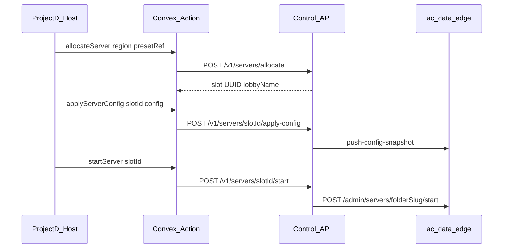

# Server platform — allocate by region + preset

Target Host UX: the web only chooses a **preset** and a **region**; the hub picks an idle physical slot, applies AC config, and starts the process.



## Prerequisites

1. Hub `DATABASE_URL` (migration `003_server_slots.sql` runs on hub boot).
2. `FLEET_EDGE_REGISTRY` maps each `instanceId` → edge `baseUrl`.
3. Bootstrap slots once:

```bash
curl -sS -X POST "$HUB/v1/servers" \
  -H "X-Worker-Secret: $SECRET" -H "Content-Type: application/json" \
  -d '{"instanceId":"vps-eu-2","region":"eu","lobbyName":"ProjectD","folderSlug":"server-1","status":"idle"}'
```

Or send non-empty `servers[]` on agent register/heartbeat (`serverId`/`name` = folder or lobby) to auto-upsert.

## API (worker secret)

| Step | Call |
|------|------|
| List free | `GET /v1/servers?region=eu&status=idle` |
| Allocate | `POST /v1/servers/allocate` `{ "region":"eu", "presetRef":"<convexPresetId>" }` |
| Apply | `POST /v1/servers/{slotId}/apply-config` body config or omit to pull Convex |
| Start | `POST /v1/servers/{slotId}/start` |
| Stop | `POST /v1/servers/{slotId}/stop` (returns slot to `idle`) |
| Live | `GET /v1/servers/{lobbyName}/live?instanceId=` (Redis — lobby name, not slot UUID) |

## What stays in Convex

- Presets (cars/track/skins product catalog enriched for UI).
- Auth / bookings / join links metadata.
- Lap and battle ingest only (after `LIVE_INGEST_CONVEX=false`).

## What lives in hub Postgres

- Slot inventory (`idle` / `allocated` / `live` / …).
- `appliedConfig` JSON per slot.
- `presetRef` string when allocated.

## ProjectD BFF

Use Next.js `/api/control/*` (Clerk + worker secret server-side). Handoff: [examples/PROJECTD_BFF_INSTALL.md](./examples/PROJECTD_BFF_INSTALL.md). Host cutover: [CONTROL_API_HOST_CUTOVER.md](./CONTROL_API_HOST_CUTOVER.md).
