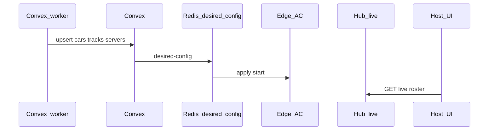
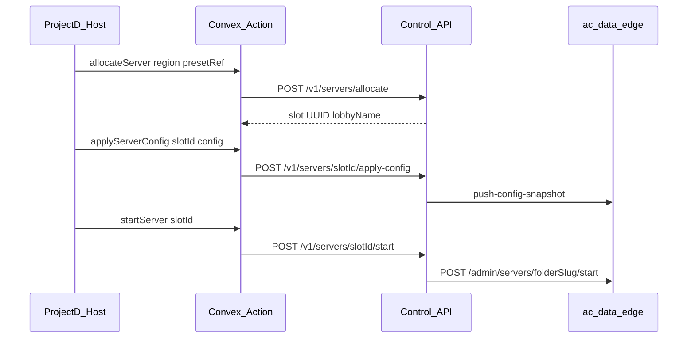

# Server platform — Host start paths

## Current Host MVP (recommended)

**Do this first.** Catalog + start live in Convex; hub is mainly for live roster (and ZIP ensure when disk is missing). Host ops (allocate / hub mod catalog) stay behind `CONTROL_API_HOST_OPS=true` (default **off**) — see [examples/PROJECTD_WEB_CONVEX_HUB_HANDOFF.md](./examples/PROJECTD_WEB_CONVEX_HUB_HANDOFF.md).

**Hub → Convex catalog sync** (cars/tracks on upload/delete; servers from edge presence): **[HOST_CATALOG_SYNC.md](./HOST_CATALOG_SYNC.md)**.

| Concern | Path |
|---------|------|
| Cars / tracks / servers product rows | Convex workers (`battle_cars`, `battle_tracks`, `servers`) — hub pushes via [HOST_CATALOG_SYNC.md](./HOST_CATALOG_SYNC.md) |
| Apply config / start | Convex → Redis desired-config → edge (`startHostSession` / `setPhysicalServerActive`) |
| Connected players | Hub `GET /v1/servers/:lobby/live?instanceId=` / `GET /v1/live/summary` — **do not** flood Convex with presence |
| ZIP on VPS disk | Hub `ensure` (ops only) |
| `POST /v1/servers/allocate` | **Phase 2** — only if `CONTROL_API_HOST_OPS=true` |



---

## Phase 2 — allocate by region + preset (optional)

Target UX when you want a shared idle pool: the web chooses **preset** + **region**; the hub picks an idle physical slot, applies AC config, and starts the process.



### Prerequisites (phase 2 only)

1. Hub `DATABASE_URL` (migration `003_server_slots.sql` runs on hub boot).
2. `FLEET_EDGE_REGISTRY` maps each `instanceId` → edge `baseUrl`.
3. Bootstrap slots once:

```bash
curl -sS -X POST "$HUB/v1/servers" \
  -H "X-Worker-Secret: $SECRET" -H "Content-Type: application/json" \
  -d '{"instanceId":"vps-eu-2","region":"eu","lobbyName":"ProjectD","folderSlug":"server-1","status":"idle"}'
```

Or send non-empty `servers[]` on agent register/heartbeat (`serverId`/`name` = folder or lobby) to auto-upsert.

### API (worker secret) — phase 2

| Step | Call |
|------|------|
| List free | `GET /v1/servers?region=eu&status=idle` |
| Allocate | `POST /v1/servers/allocate` `{ "region":"eu", "presetRef":"<convexPresetId>" }` |
| Apply | `POST /v1/servers/{slotId}/apply-config` body config or omit to pull Convex |
| Start | `POST /v1/servers/{slotId}/start` |
| Stop | `POST /v1/servers/{slotId}/stop` (returns slot to `idle`) |
| Live | `GET /v1/servers/{lobbyName}/live?instanceId=` (Redis — lobby name, not slot UUID) |

### What stays in Convex

- Presets / `battle_cars` / `battle_tracks` / `servers` product catalog.
- Auth / bookings / join links metadata.
- Lap and battle ingest; presence stay off Convex when `LIVE_INGEST_CONVEX=false`.

### What lives in hub Postgres (phase 2)

- Slot inventory (`idle` / `allocated` / `live` / …).
- `appliedConfig` JSON per slot.
- `presetRef` string when allocated.

## ProjectD BFF

Use Next.js `/api/control/*` (Clerk + worker secret server-side) for **live** (and ensure if needed). Handoff: [examples/PROJECTD_BFF_INSTALL.md](./examples/PROJECTD_BFF_INSTALL.md). Host cutover: [CONTROL_API_HOST_CUTOVER.md](./CONTROL_API_HOST_CUTOVER.md). MVP web: [examples/PROJECTD_WEB_CONVEX_HUB_HANDOFF.md](./examples/PROJECTD_WEB_CONVEX_HUB_HANDOFF.md).
