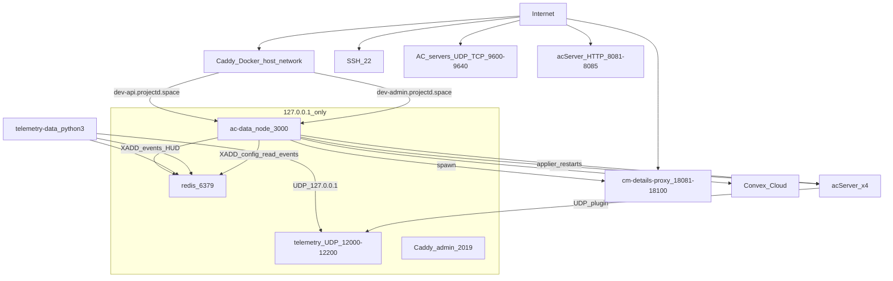
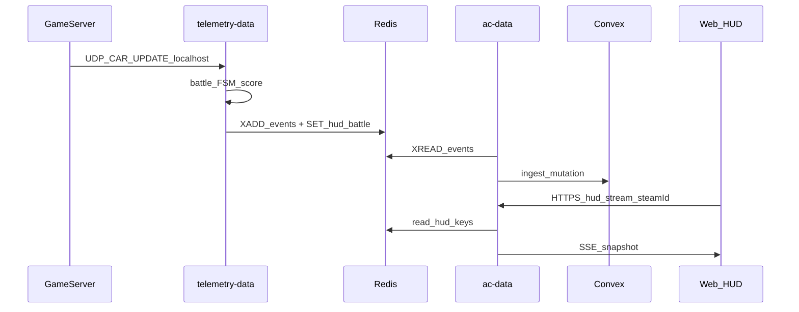

# VPS SECURITY AUDIT — Fase 1 (solo diagnóstico)

**Alcance:** VPS en `/home/jose/assetto-infra` — inspección read-only (puertos, procesos, configs, logs, código). **Nada fue modificado, reiniciado, ni explotado de forma destructiva.**

**Limitaciones:** Reglas iptables/nftables no legibles sin root; `.env.production` ausente en este host; historial git remoto no auditado; pruebas activas de IDOR/exploit no ejecutadas.

---

## INFRASTRUCTURE MAP



| Componente | Proceso | Usuario | Bind | Rol |
|------------|---------|---------|------|-----|
| **ac-data** | node/tsx pid 1971306 | jose | 127.0.0.1:3000 | API, admin, HUD SSE, control AC, bridge Convex↔Redis |
| **telemetry-data** | python3 main.py | jose | UDP 127.0.0.1:12000+ | Telemetría, batallas, scoring, publish HUD Redis |
| **Redis** | redis-server | redis | 127.0.0.1:6379 | Streams `ac:events`, `ac:config`, keys HUD/ban |
| **Caddy** | Docker `assetto-caddy` | root (host net) | *:80, *:443 | TLS + reverse proxy a ac-data |
| **acServer** | 4 instancias | jose | *:9600-9640, *:8081-8085 | Game servers |
| **cm-details-proxy** | 20× node | jose | 0.0.0.0:18081-18100 | `/api/details` para Content Manager |
| **Convex** | cloud | N/A | HTTPS outbound | Config, HUD, player join, ingest |

**No detectados en ejecución:** nginx, systemd units assetto/ac-data/telemetry, Server Manager (:8772), PostgreSQL/MySQL.

**Orquestación:** [`start.sh`](start.sh) (nohup), no systemd en repo. Docker compose prod define Redis+ac-data+telemetry pero AGENTS.md indica ac-data en host.

---

## NETWORK EXPOSURE

| Superficie | Público | Esperado | Riesgo |
|------------|---------|----------|--------|
| SSH :22 | Sí (0.0.0.0) | Admin | Medio — `PermitRootLogin yes`, sin fail2ban verificado |
| HTTP/S :80/:443 | Sí | Sí (Caddy) | Bajo si TLS correcto |
| ac-data :3000 | **No** (127.0.0.1) | Sí | **Bien** — `AC_DATA_BIND_HOST=127.0.0.1` en [`.env.local`](.env.local) |
| Redis :6379 | **No** (127.0.0.1) | Sí | **Bien** en bind; sin password (ver Redis) |
| Game UDP/TCP 9600-9640 | Sí | Sí (juego) | Inherente al producto |
| acServer HTTP 8081-8085 | Sí | Discutible | Expone `/INFO` (200 OK verificado) |
| cm-proxy 18081-18100 | Sí | Discutible | Metadata CM sin auth |
| Caddy admin :2019 | localhost | Interno | Bien |
| telemetry UDP | localhost | Sí | Bien |

**Caddy** ([`deploy/caddy/Caddyfile`](deploy/caddy/Caddyfile)): `dev-api.projectd.space` y `dev-admin.projectd.space` → `127.0.0.1:3000`. Expone **toda** la API ac-data (incl. `/admin/*`, `/client/*`, `/hud/*`) a Internet vía HTTPS.

**Firewall:** UFW no instalado. [`install.sh`](install.sh) abre iptables para puertos de juego, 3000, 8772, plugins — **reglas activas NOT VERIFIED** (sin sudo).

---

## OPEN PORTS (inventario)

| PORT | PROTO | BIND | PROCESS | USER | SERVICE | PUBLIC | EXPECTED | RISK |
|------|-------|------|---------|------|---------|--------|----------|------|
| 22 | tcp | 0.0.0.0 | sshd | root | SSH | PUBLIC | Yes | MEDIUM |
| 80,443 | tcp | * | caddy | root | Reverse proxy | PUBLIC | Yes | LOW |
| 3000 | tcp | 127.0.0.1 | node | jose | ac-data | PRIVATE | Yes | LOW |
| 6379 | tcp | 127.0.0.1 | redis | redis | Redis | PRIVATE | Yes | MEDIUM (no auth) |
| 9600-9640 | udp/tcp | * | acServer | jose | Game | PUBLIC | Yes | LOW (game) |
| 8081-8085 | tcp | * | acServer | jose | AC HTTP | PUBLIC | Maybe | MEDIUM |
| 12001,12011,12021,12051 | udp | * | acServer | jose | Plugin | PUBLIC | Yes | LOW |
| 18081-18100 | tcp | 0.0.0.0 | node cm-proxy | jose | CM details | PUBLIC | Maybe | MEDIUM |
| 12000-12200 | udp | 127.0.0.1 | python3 | jose | Telemetry ingress | PRIVATE | Yes | LOW |
| 2019 | tcp | 127.0.0.1 | caddy | root | Caddy admin | PRIVATE | Yes | LOW |

---

## AC-DATA SECURITY

### Endpoints expuestos vía Caddy (Internet)

| Ruta | Auth actual | Evidencia |
|------|-------------|-----------|
| `/api/health` | Ninguna | [`healthController.ts`](ac-data/src/controller/healthController.ts) |
| `/ac-server/*` | `API_KEY` | **Bloqueado** si key unset → HTTP 500 (probado) |
| `/client/*` | Opcional (`CLIENT_LAUNCHER_REQUIRE_API_KEY=false`) | Público — bootstrap 200 OK |
| `/hud/stream`, `/hud/snapshot` | `HUD_API_KEY` | **Bypass si unset** — [`hudBattleAuth.ts`](ac-data/src/services/hud/hudBattleAuth.ts) L3-7; **`HUD_API_KEY` ausente en `.env.local`** |
| `/admin/login` | Ninguna | Credenciales en body |
| `/admin/*` | JWT cookie | Tras login |
| `/hud/worker/*` | `CONVEX_WORKER_SECRET` | Sin rate limit |

### Hallazgos críticos ac-data

**AUD-001 CRITICAL — HUD auth bypass**
- Si `HUD_API_KEY` vacío → cualquier request con `steamId` de jugador **online** obtiene snapshot/SSE.
- Código: `isHudApiKeyValid()` retorna `true` cuando key vacía.
- No hay binding caller↔steamId (IDOR arquitectural).

**AUD-002 CRITICAL — Admin panel expuesto con credenciales débiles**
- `.env.local`: `ADMIN_USER=admin`, `ADMIN_PASS=admin123`, `ADMIN_JWT_SECRET=change-this-secret-in-production`
- Código fallback idéntico en [`adminAuth.ts`](ac-data/src/middleware/adminAuth.ts)
- `/admin/login` **sin rate limiting** — brute-force vía `dev-admin.projectd.space`
- Login devuelve JWT en JSON además de cookie

**AUD-003 HIGH — Control plane `/ac-server`**
- Con `API_KEY` configurada: start/stop/restart/config **sin validación** `serverName` en [`serverHttpController.ts`](ac-data/src/controller/serverHttpController.ts) vs admin que usa `^server(-\d+)?$`
- `startServerCore`: `path.join(SERVERS_PATH, serverName, 'acServer')` — path traversal potencial si `API_KEY` leak
- `spawn(acServer)`, `execSync('pkill -f acServer.*${name}')` en [`controller.ts`](ac-data/src/controller/controller.ts)

**AUD-004 HIGH — INI injection**
- `applyServerConfiguration` escribe campos sin sanitizar newlines (`displayName`, `password`, `track`)

**AUD-005 MEDIUM — CORS wildcard**
- `CLIENT_LAUNCHER_CORS_ORIGIN=*`, HUD CORS default `*`

**AUD-006 MEDIUM — Worker endpoints sin rate limit**
- `POST /hud/worker/refresh-user` acepta secret en body; cualquier steamId

---

## TELEMETRY-DATA SECURITY

### Ingesta
- **UDP localhost only** — [`telemetry-data/main.py`](telemetry-data/main.py) `SERVER_IP=127.0.0.1`
- **Sin autenticación criptográfica** — primer paquete UDP = confianza implícita ([`handlers/__init__.py`](telemetry-data/core/handlers/__init__.py))
- **Sin HTTP API** en telemetry-data

### Qué puede READ/WRITE
| Acción | Mecanismo | Auth |
|--------|-----------|------|
| READ config | Redis stream `ac:config` | Redis access only |
| WRITE events | `XADD ac:events` | Redis access only |
| WRITE battle HUD | `battle_hud_publisher.py` | Redis access only |
| WRITE kick/chat | UDP outbound a AC | Trust server state |
| subprocess | **No encontrado** | — |

### Integridad telemetría / batallas
- Scores **calculados server-side** desde `CAR_UPDATE` (FSM en [`engines/battlesystem/`](telemetry-data/engines/battlesystem/)) — clientes no POSTean scores
- **Residuo:** Redis forgery puede insertar eventos/HUD falsos; UDP localhost spoof si proceso malicioso en host
- Scripts admin [`simulate-battle-complete.sh`](scripts/simulate-battle-complete.sh) pueden `XADD` directamente

**AUD-007 HIGH — Redis como único trust boundary**
- Sin firma HMAC en payloads `ac:events` / `ac:config`
- [`redisConfigApplier.ts`](ac-data/src/services/redisConfigApplier.ts) filtra por `instanceId` pero **confía ciegamente** en payload JSON → puede reescribir INI + restart servers

---

## GAME SERVER ISOLATION

**Estado actual:** acServer, ac-data, telemetry, cm-proxy → **mismo UID `jose`**

Si acServer comprometido:
| Recurso | Accesible | Evidencia |
|---------|-----------|-----------|
| `.env.local` (664 world-readable) | **Sí** | permisos + mismo user |
| Redis localhost sin password | **Sí** | `requirepass` vacío |
| ac-data HTTP localhost:3000 | **Sí** | loopback |
| telemetry UDP | **Sí** | localhost plugin ports |
| Docker socket | **Sí** | jose ∈ group `docker` |
| sudo | **Posible** | jose ∈ group `sudo` |
| Otros game servers | **Parcial** | mismo filesystem bajo `server/` |
| Convex directo | **No** | solo ac-data tiene keys |

**Ideal vs real:**

```
REAL:  GameServer → jose UID → .env + Redis + docker.sock + sudo
IDEAL: GameServer → mínimo → plugin UDP only → sin secrets host
```

**AUD-008 CRITICAL — Sin aislamiento de procesos game vs control plane**

---

## DATABASE SECURITY

**No hay PostgreSQL/MySQL/MongoDB local.**

Datos persistentes:
- **Convex** (cloud) — ac-data bridge con `CONVEX_PRODUCT_KEY`, `CONVEX_INGEST_SECRET`, `CONVEX_WORKER_SECRET`
- **Redis** (local dev) — streams + keys HUD
- **BoltDB** referenciado en [`config.yml`](config.yml) para Server Manager (no activo)

**Aislamiento DB users:** N/A — un solo Redis sin ACL/password; Convex un solo product key.

---

## REDIS SECURITY

| Parámetro | Valor observado | Riesgo |
|-----------|-----------------|--------|
| bind | 127.0.0.1, ::1 | OK |
| requirepass | **vacío** | HIGH — cualquier proceso local = full access |
| protected-mode | yes | Mitiga remoto si bind correcto |
| REDIS_PASSWORD en .env.local | vacío | HIGH |

**Prod compose** ([`docker-compose.prod.yml`](docker-compose.prod.yml)): publica `6379:6379` — **HIGH si desplegado sin password/firewall**.

---

## SSH SECURITY

| Setting | Valor |
|---------|-------|
| PermitRootLogin | **yes** |
| PasswordAuthentication | **no** (drop-in cloudimg) |
| authorized_keys | 600 jose:jose |
| fail2ban | **NOT VERIFIED / no encontrado en repo** |
| Últimos logins | Solo jose/root desde 139.47.121.150 (Jun 19) |

---

## DOCKER SECURITY

| Container | network_mode | privileged | docker.sock | Notas |
|-----------|--------------|------------|-------------|-------|
| assetto-caddy | **host** | false | no | Esperado para :80/:443 |
| telemetry (prod compose) | **host** | false | no | Comparte namespace red host |
| redis (prod compose) | bridge + **6379 published** | false | no | Riesgo si prod |

**jose ∈ docker group** → acceso `/var/run/docker.sock` (660 root:docker) = **control efectivo del host**.

---

## FILESYSTEM SECURITY

| Path | Mode | Issue |
|------|------|-------|
| `.env.local` | **664** (world-readable) | SECRET FOUND — cualquier user local lee Convex/admin secrets |
| `scripts/*.sh`, root `*.sh` | 775 | Overly permissive |
| `server/acServer` | 775 jose | Ejecutable por grupo/other |
| [`config.yml`](config.yml) | **tracked in git** | SECRET FOUND — Steam password plaintext `[REDACTED]` |

**Privilege escalation pattern:**
```
ROOT executes cron/systemd (NOT assetto-specific)
USER jose CAN MODIFY .env.local, scripts, acServer binaries
→ service restart picks up poisoned config
```

**AUD-009 CRITICAL — Steam credentials committed in `config.yml` (git tracked)**

---

## SECRETS (redacted)

| ID | Location | Process with access | Risk |
|----|----------|---------------------|------|
| S-01 | `.env.local` | ac-data, telemetry, shell user jose, **any local user (o+r)** | CRITICAL |
| S-02 | `.env.local` CONVEX_* | ac-data | HIGH if leaked |
| S-03 | `.env.local` ADMIN_* | ac-data admin | CRITICAL (weak values) |
| S-04 | [`config.yml`](config.yml) steam.password | git clone, anyone with repo | CRITICAL |
| S-05 | Code defaults adminAuth.ts | ac-data if env unset | HIGH |
| S-06 | CONVEX_WORKER_SECRET | ac-data worker routes | HIGH — value `[REDACTED]` |

---

## PRIVILEGE ESCALATION RISKS

1. **jose → docker.sock → root-equivalent containers**
2. **jose → sudo** (password NOT VERIFIED)
3. **Local user → read .env.local (664) → admin JWT forge / Convex abuse**
4. **Redis write → ac:config → INI + server restart** (indirect code execution as jose)
5. **Admin JWT weak secret → forge admin token**

---

## PERSISTENCE INDICATORS

| Check | Result |
|-------|--------|
| User crontab | Vacío |
| /etc/cron.d | Solo sysstat, e2scrub — normal |
| systemd assetto units | No encontrados |
| Procesos anómalos | **Muchos node/esbuild de tests ac-data** (Jun-Aug) — operational noise, no malware confirmado |
| authorized_keys | 1 key, permisos OK |

**SUSPICIOUS:** Ninguno confirmado. Test processes = cleanup recomendado (fase 2).

---

## LOGGING

| Log | Size | Observaciones |
|-----|------|---------------|
| ac-data.log | **19 MB** | Crecimiento — riesgo disco a largo plazo |
| telemetry-data.log | 80 KB | OK |
| /var/log/auth.log | 7.5 MB | SSH journal vacío en ventana 7d |
| logrotate | systemd timer activo | OK |

**Gaps:** No SIEM, no alertas, no fail2ban, monitoring en [`config.yml`](config.yml) `enabled: false`.

---

## BACKUPS

**NOT VERIFIED** — No scripts/cron de backup encontrados en repo para ac-data/telemetry/server configs. `dpkg-db-backup.timer` solo paquetes OS.

**Riesgo:** Backup en mismo VPS no confirmado = sin protección ante compromiso total.

---

## RESOURCE EXHAUSTION

| Vector | Riesgo | Evidencia |
|--------|--------|-----------|
| ac-data.log unbounded | MEDIUM | 19MB, no rotation en repo |
| HUD SSE connections | MEDIUM | rate limit skipped on `/hud/stream` |
| Redis memory | MEDIUM | sin maxmemory policy verificada |
| RAM | MEDIUM | 4.6/7.8 Gi used, **0 swap** |
| Telemetry flood UDP | LOW | localhost only; single-threaded handlers |
| Admin upload 500MB | MEDIUM | multer limit en adminRoutes |

---

## CRITICAL FLOWS



**Autoridad batallas:** telemetry FSM → Redis → ac-data SSE → HUD Lua (read-only display).

---

## ATTACK CHAINS

**CHAIN-1 (CRITICAL): Internet → Admin takeover**
```
dev-admin.projectd.space → /admin/login (no rate limit)
→ admin/admin123 (env + code defaults)
→ JWT admin → content upload / server config / branding bash scripts
→ spawn acServer, modify INI, read Redis/Convex via process env
```

**CHAIN-2 (HIGH): Local/host process → Full telemetry forgery**
```
any local process → redis-cli (no password, 127.0.0.1)
→ XADD ac:events fake battles/laps
→ XADD ac:config malicious snapshot
→ ac-data applier rewrites INI + restarts servers
→ Convex ingest if events pass schema
```

**CHAIN-3 (HIGH): HUD data exfiltration**
```
Internet → dev-api.projectd.space/hud/snapshot?steamId=X
(HUD_API_KEY unset → no key needed)
→ live battle/session for online player X
```

**CHAIN-4 (HIGH): API_KEY leak → host control as jose**
```
leaked API_KEY → POST /ac-server/servers/../../etc/passwd/start (path traversal attempt)
→ or POST .../config with INI injection
→ spawn/kill acServer processes
```

**CHAIN-5 (CRITICAL): Game server → host**
```
compromised acServer (same jose)
→ read .env.local (664)
→ redis-cli forge all streams
→ curl localhost:3000/admin if JWT obtained
→ docker run privileged (via docker.sock)
```

---

## MISSING CONTROLS

- Fail2ban / SSH rate limiting
- `HUD_API_KEY` required at startup (fail-closed)
- Admin login rate limit + strong password enforcement
- Redis AUTH + ACLs
- Separate OS users: acdata, telemetry, gameserver
- systemd hardening (NoNewPrivileges, PrivateTmp)
- Secret rotation; remove `config.yml` credentials from git
- `.env.local` chmod 600
- HMAC signing on Redis streams
- Per-steamId HUD auth binding
- Centralized monitoring/alerting
- Off-VPS encrypted backups
- WAF / IP allowlist on admin vhost
- Remove jose from docker group (rootless docker or dedicated deploy user)

---

## MATRIZ DE IMPACTO (selección)

| ID | SEVERITY | COMPONENT | ROOT CAUSE | IMPACT |
|----|----------|-----------|------------|--------|
| AUD-001 | CRITICAL | ac-data HUD | Optional HUD_API_KEY | Exfil live battle/session any online player |
| AUD-002 | CRITICAL | ac-data admin | Weak creds + public admin vhost | Full fleet control, uploads, scripts |
| AUD-008 | CRITICAL | isolation | Shared jose UID | Game compromise = host secrets |
| AUD-009 | CRITICAL | config.yml | Secret in git | Steam account compromise |
| AUD-007 | HIGH | Redis | No AUTH/signing | Forge telemetry, config, bans, HUD |
| AUD-003 | HIGH | /ac-server | Missing serverName validation | Path traversal + process control if API_KEY set |
| AUD-010 | HIGH | filesystem | .env.local 664 | Local privilege / secret leak |
| AUD-011 | HIGH | docker | jose in docker group | Container escape to host root |
| AUD-012 | MEDIUM | SSH | PermitRootLogin yes | Expanded SSH attack surface |
| AUD-013 | MEDIUM | cm-proxy | 0.0.0.0 no auth | Server metadata disclosure |
| AUD-014 | MEDIUM | logs | Unbounded ac-data.log | Disk exhaustion |
| AUD-015 | INFO | backups | Not configured | No recovery from compromise |

---

## CONTEO SEVERIDAD

| Level | Count |
|-------|-------|
| **CRITICAL** | 5 |
| **HIGH** | 8 |
| **MEDIUM** | 12 |
| **LOW** | 6 |
| **INFO** | 5 |

---

## TOP 10 RISKS

1. **Admin panel público con admin/admin123** — takeover total vía Caddy
2. **HUD_API_KEY ausente** — bypass auth en `/hud/*` para jugadores online
3. **Game servers mismo UID que control plane (jose)** — compromiso game = compromiso host
4. **Steam password en `config.yml` git-tracked** — credential leak permanente
5. **Redis sin password** — forgery total telemetría/config/HUD desde cualquier proceso local
6. **jose en grupo docker** — escalada a root vía docker.sock
7. **`.env.local` world-readable (664)** — all secrets readable by local users
8. **Redis config applier confía en streams sin firma** — INI rewrite + server restart
9. **`/ac-server` sin validación serverName** — path traversal si API_KEY se configura
10. **cm-proxy + acServer HTTP expuestos 0.0.0.0** — metadata/inventory disclosure

---

## PREGUNTA FINAL (respuesta honesta)

### Si mañana alguien encuentra una vulnerabilidad en AC-DATA, ¿hasta dónde podría llegar?

**Muy lejos, casi certainly compromiso operacional completo del VPS como user `jose`, y potencialmente root.**

ac-data corre como jose con acceso a: spawn/kill acServer (`execSync`/`spawn`), escribir INIs, leer/escribir Redis, credenciales Convex en env, panel admin, uploads 500MB, scripts bash de branding, y el usuario está en grupos **sudo** y **docker**. Una RCE o auth bypass en admin/HUD/worker routes no se queda en "solo API" — es control de flota, telemetría, y puerta a docker.sock. **No verified:** explotación real de sudo sin password.

### Si mañana comprometen un game server, ¿hasta dónde podrían llegar?

**Mismo nivel que jose en la práctica** — porque acServer corre como jose, no en contenedor aislado. Pueden leer `.env.local`, hablar con Redis sin auth, enviar UDP falso a telemetry, llamar ac-data en localhost, y usar docker.sock. **No** Convex directo sin robar secrets de `.env.local` primero (trivial con 664 permissions).

### Si mañana comprometen TELEMETRY-DATA, ¿qué podrían modificar?

**Todo lo que pasa por Redis y comandos UDP al game server:** scores/battle HUD publicados, eventos en `ac:events` (→ Convex ingest vía ac-data), kicks/chats/admin commands a AC, estados de batalla en Redis. **No** pueden spawn acServer directamente (no subprocess en telemetry), pero pueden **indirectamente** trigger config changes si combinan with forged `ac:config` consumed by ac-data applier.

### ¿Qué tendría que cambiar para que una vulnerabilidad en un componente NO implique automáticamente el compromiso de todo el VPS?

1. **Usuarios OS separados** — gameserver (sin secrets), telemetry (Redis ACL write-only streams), ac-data (minimal)
2. **Redis** — requirepass, ACLs per-service, TLS en prod, HMAC en payloads
3. **ac-data** — bind localhost only (done), **mandatory** HUD_API_KEY + admin strong secrets + rate limits, fail-closed startup
4. **Admin** — IP allowlist/VPN, separate vhost con mTLS, no public Internet
5. **Game servers** — containers/seccomp, no shared home dir, no access to `.env`
6. **Remove docker group** from runtime user or rootless docker
7. **Secrets** — chmod 600, git history purge for config.yml, rotation
8. **Network** — firewall default deny; only 443, game ports, SSH from allowlist
9. **Signed config pipeline** — Convex→Redis→applier with HMAC verification
10. **Monitoring + offsite backups**

---

## Fase 2 (remediación aplicada)

Ver [VPS_SECURITY_HARDENING.md](./VPS_SECURITY_HARDENING.md) para pasos manuales restantes (Redis restart, Convex/Steam rotation, git history purge, OS isolation).

Cambios en código/repo:
- HUD fail-closed, admin startup validation, login rate limit
- serverName validation en /ac-server
- config.yml sanitizado + gitignore
- scripts: rotate-vps-secrets, apply-redis-local-auth, audit-firewall, purge-config-secrets-from-git-history
