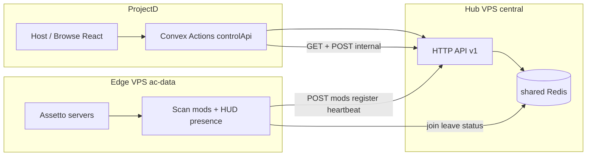

# Especificación hub central — handoff para VPS (ProjectD)

Documento canónico para alinear el **HUB_VPS_SPEC** de ProjectD con lo implementado en **assetto-infra**. Si hay conflicto, gana este archivo + [CONTROL_API_V1.md](./CONTROL_API_V1.md).

También: [CONTROL_API_HOST_CUTOVER.md](./CONTROL_API_HOST_CUTOVER.md) · [SERVER_PLATFORM.md](./SERVER_PLATFORM.md) · [openapi/control-api-v1.yaml](./openapi/control-api-v1.yaml) · [examples/PROJECTD_BFF_INSTALL.md](./examples/PROJECTD_BFF_INSTALL.md) · [VPS_FLEET_SETUP.md](./VPS_FLEET_SETUP.md).

Copiar a ProjectD como `docs/HUB_VPS_SPEC.md` (o `docs/control-api-vps-spec.md`) y actualizar §4/§9 del borrador que asumía `POST …/live`.

---

## 1. Roles: quién hace qué



| Componente | Responsabilidad |
|------------|-----------------|
| **Edge (cada VPS de juego)** | Escanear content → `POST /v1/agents/{instanceId}/mods`. Escribir roster/presence en **Redis compartido** (`ac:hud:presence*`). Register/heartbeat al hub. Ingest Convex para **laps/batallas** (live opcional vía `LIVE_INGEST_CONVEX`). |
| **Hub (un backend central)** | Recibir POST mods + agent presence; **leer** live desde Redis; servir GET; `desired-config`. Auth `X-Worker-Secret`. HTTPS público (Convex cloud). |
| **ProjectD** | Metadato en Convex (presets, assignments, join URLs). Ops data (mods en disco, jugadores) vía **Convex Actions → hub GET**. Browser **nunca** llama al hub. |

---

## 2. Variables de entorno (alias)

### Hub

| Variable | Uso |
|----------|-----|
| `REDIS_URL` / `REDIS_HOST` (+ auth) | Obligatorio; **mismo Redis** que los edges para live |
| `CONVEX_WORKER_SECRET` | Valor del header `X-Worker-Secret` (ProjectD lo llama a veces `WORKER_INGEST_SECRET`) |
| `PORT` | Ej. 3100 detrás de Caddy/nginx |

### Convex (ProjectD dashboard)

```bash
CONTROL_API_URL=https://hub.tudominio.com   # sin trailing slash
CONVEX_WORKER_SECRET=<mismo secret que hub>
```

Alias opcional de URL: `AC_DATA_BASE_URL` (= hub, no un edge).

### Edge

| Variable ProjectD (doc antiguo) | Variable real (assetto-infra) |
|---------------------------------|-------------------------------|
| `CONTROL_API_BASE_URL` | `BACKEND_INGEST_URL` o `BACKEND_WORKER_URL` (base del hub) |
| `WORKER_INGEST_SECRET` | `CONVEX_WORKER_SECRET` → header `X-Worker-Secret` |
| `AC_INSTANCE_ID` | Igual — debe = `vps_hosts.instanceId` en Convex |
| `MOD_INVENTORY_SCAN_ENABLED=true` | Igual |
| `LIVE_INGEST_CONVEX=false` | **Solo después** del cutover Host — [CONTROL_API_HOST_CUTOVER.md](./CONTROL_API_HOST_CUTOVER.md) |

También: `CONTROL_API_AGENT_PRESENCE_ENABLED=true`, `CONTROL_API_AGENT_HEARTBEAT_MS=20000`.

---

## 3. Identificadores (contrato)

| ID | Origen | Uso en hub |
|----|--------|------------|
| `instanceId` | `vps_hosts.instanceId` / edge `AC_INSTANCE_ID` | Partición mods + roster scoped |
| `serverId` en **GET live** | **Nombre de lobby AC normalizado** (p.ej. `ProjectD`), **no** Convex `servers._id` | Clave Redis `…:roster:{instanceId}:{normalizedLobby}` |

### `serverId`: Convex `_id` vs lobby name

El edge indexa presence por **nombre de lobby** (campo NAME / server name normalizado), no por el document id de Convex.

- Host/Browse deben mapear `servers._id` → lobby name (ProjectD `EDGE_SERVER_ID_MAP`) **antes** de llamar `getServerLive`.
- Pasar siempre `?instanceId=` en multi-VPS (o path compuesto `instanceId:lobby`).
- Si se llama con un Convex `_id` crudo y no hay roster con ese string → `ok: true`, `players: []`, `updatedAt: null` (no 404).

Presets Convex siguen usando slugs de disco:

- Coche: `entries[].model` = `carModel`
- Pista: `battle_tracks.track` = `trackSlug`
- Layout: `trackConfig` ∈ `configs[]`
- Skin: `entries[].skin` ∈ `skins[]`

---

## 4. Ingest — Edge → Hub

Auth en POST de agente:

```http
X-Worker-Secret: <secret>
Content-Type: application/json
```

| Ruta | Frecuencia | Contenido |
|------|------------|-----------|
| `POST /v1/agents/{instanceId}/mods` | Boot + periódico (`MOD_INVENTORY_SCAN_MS`) | cars + tracks + etag |
| `POST /v1/agents/register` | Boot | instanceId, region, servers[] |
| `POST /v1/agents/heartbeat` | ~20s | refresca TTL agent |

### Live — **no** hay `POST /v1/agents/.../live`

El borrador ProjectD que pedía POST live cada 3–5s **está desfasado**. Write path real:

1. Telemetría → Redis stream `ac:events` en el edge  
2. Bridge → keys HUD en **Redis compartido hub↔edge**  
3. Hub `GET /v1/servers/.../live` y `GET /v1/live/summary` **solo leen** Redis  

Reglas edge:

- Prohibido `convex.query` en el loop de presence (3–5s).  
- `LIVE_INGEST_CONVEX=false` tras cutover: join/leave/`server_status` locales (Redis/HUD); laps/batallas siguen a Convex.

---

## 5. Lectura — Hub → ProjectD (GET vía Convex)

```http
Accept: application/json
X-Worker-Secret: <CONVEX_WORKER_SECRET>
```

Todas las respuestas de ops incluyen `"ok": true`.

### `GET /v1/instances/{instanceId}/mods/cars`

```json
{
  "ok": true,
  "instanceId": "eu-prod-1",
  "cars": [
    {
      "carModel": "ks_mazda_miata_na",
      "displayName": "Mazda MX-5 NA",
      "skins": ["0", "red_01"]
    }
  ],
  "meta": {
    "etag": "…",
    "scannedAt": 1730000000000,
    "carCount": 142,
    "trackCount": 38
  }
}
```

`meta` puede ser `null` si no hay scan aún.

### `GET /v1/instances/{instanceId}/mods/tracks`

```json
{
  "ok": true,
  "instanceId": "eu-prod-1",
  "tracks": [
    { "trackSlug": "ek_akagi", "configs": ["downhill", "uphill"] }
  ],
  "meta": { "etag": "…", "scannedAt": 1730000000000, "carCount": 142, "trackCount": 38 }
}
```

### `GET /v1/servers/{serverId}/live?instanceId={optional}`

`serverId` = **lobby name** (ver §3). Query `instanceId` recomendada en multi-VPS.

```json
{
  "ok": true,
  "serverId": "ProjectD",
  "instanceId": "eu-prod-1",
  "updatedAt": 1730000003000,
  "players": [
    {
      "steamId": "76561198012345678",
      "name": "DriverOne",
      "carModel": "ks_mazda_miata_na",
      "track": "ek_akagi",
      "trackConfig": "downhill",
      "instanceId": "eu-prod-1",
      "folderSlug": "server-1",
      "updatedAt": 1730000003000
    }
  ]
}
```

Sin datos recientes: `ok: true`, `players: []`, `updatedAt: null` (no 404).

### `GET /v1/live/summary`

```json
{
  "ok": true,
  "servers": [
    {
      "serverId": "ProjectD",
      "instanceId": "eu-prod-1",
      "playerCount": 2,
      "updatedAt": 1730000003000
    }
  ]
}
```

`serverId` en summary = lobby name. Browse cruza con la lista de servidores de Convex vía mapa `_id` → lobby.

---

## 6. Internal — ProjectD → Hub

```http
POST /v1/internal/desired-config
X-Worker-Secret: …
Content-Type: application/json

{
  "instanceId": "eu-prod-1",
  "serverId": "optional-filter",
  "configVersion": "optional",
  "reason": "host_preset"
}
```

Respuesta: `{ "ok": true, "instanceId": "…", "errors": [], "mode": "…" }` (o errores `track_not_installed` / `car_not_installed`).

Hub valida preset vs mods snapshot y empuja apply al edge correcto.

### Server slots (plataforma)

Con `DATABASE_URL`, el hub guarda slots físicos en Postgres y expone:

- `GET /v1/servers?region=&status=idle`
- `POST /v1/servers/allocate` `{ "region", "presetRef?" }`
- `POST /v1/servers/{slotId}/apply-config|start|stop|restart`

Flujo Host: **región + preset → allocate → apply → start**. Ver [SERVER_PLATFORM.md](./SERVER_PLATFORM.md).

---

## 7. Qué **no** debe hacer el hub

- No llamar Convex en cada GET (solo Redis/estado propio).  
- No exponer el worker secret al browser.  
- No mezclar `instanceId` distintos en la misma key de mods/roster.  
- **No** implementar `POST /v1/agents/.../live` (live = Redis HUD).

---

## 8. Qué sigue en Convex (v1 ProjectD)

El hub **no** reemplaza:

- Auth, presets de producto, join links / colas de UI.  
- Ingest de laps y batallas.

Start/stop/allocate de slots físicos **sí** van al hub (`SERVER_PLATFORM.md`). Browse puede seguir listando metadatos desde Convex y cruzar con `GET /v1/servers` + live summary.

Fase futura opcional: directorio operativo 100% desde Redis — hoy no hay action en ProjectD.

---

## 9. Redis (keys reales)

| Key | TTL | Contenido |
|-----|-----|-----------|
| `instance:{instanceId}:mods:cars` | Largo | JSON cars |
| `instance:{instanceId}:mods:tracks` | Largo | JSON tracks |
| `instance:{instanceId}:mods:meta` | Largo | etag, scannedAt, counts |
| `instance:{instanceId}:agent` | ~90s | register/heartbeat |
| `ac:hud:presence:{steamId}` | Presence TTL | Player record |
| `ac:hud:presence:roster:{instanceId}:{lobby}` | Roster TTL | SteamId list (replaced on `server_status`) |
| `ac:hud:presence:roster:{lobby}` | Legacy | Unscoped roster (aún legible) |

**No** se usan `live:server:{serverId}`, `mods:instance:{…}`, ni `live:summary` como keys persistidas — summary se **reconstruye** al leer/SCAN de keys roster activas.

Multi-VPS: cada edge escribe solo sus keys scoped; summary = unión de rosters vivos.

---

## 10. Checklist “listo para ProjectD”

1. Hub HTTPS accesible desde internet (Convex cloud).  
2. Secret compartido hub + Convex dashboard.  
3. Redis **compartido** hub ↔ edges (live vacío si Redis distintos).  
4. Edge `AC_INSTANCE_ID` = fila Convex `vps_hosts.instanceId`.  
5. POST mods → GET cars/tracks con inventario real (`ok: true`).  
6. Jugadores en AC → GET live (lobby name) + summary &lt; 10 s.  
7. Segundo VPS con otro `instanceId` no contamina mods/live del primero.  
8. Host mapea Convex `_id` → lobby name antes de `getServerLive`.  
9. Tras validar UI: `LIVE_INGEST_CONVEX=false` en edges.

### Smoke curl

```bash
export HUB=https://your-hub.example.com
export SECRET=…
export INSTANCE=vps-eu-2
export LOBBY=ProjectD   # nombre de lobby, NO Convex _id

# Mods (tras scan edge)
curl -sS "$HUB/v1/instances/$INSTANCE/mods/cars" -H "X-Worker-Secret: $SECRET"
curl -sS "$HUB/v1/instances/$INSTANCE/mods/tracks" -H "X-Worker-Secret: $SECRET"

# Live + summary (con jugadores en AC)
curl -sS "$HUB/v1/servers/$LOBBY/live?instanceId=$INSTANCE" -H "X-Worker-Secret: $SECRET"
curl -sS "$HUB/v1/live/summary" -H "X-Worker-Secret: $SECRET"

# Agent presence (ops)
curl -sS "$HUB/v1/agents/$INSTANCE" -H "X-Worker-Secret: $SECRET"

# Aislamiento: otro INSTANCE no debe devolver los mismos cars ni mezclar roster
# export INSTANCE2=vps-us-1
# curl -sS "$HUB/v1/instances/$INSTANCE2/mods/cars" -H "X-Worker-Secret: $SECRET"
```

BFF Host: [examples/PROJECTD_BFF_INSTALL.md](./examples/PROJECTD_BFF_INSTALL.md).

---

## 11. Mantenimiento del contrato

- Canónico en assetto-infra: este archivo + [CONTROL_API_V1.md](./CONTROL_API_V1.md) + OpenAPI.  
- Cambios de path/JSON → actualizar `convex/controlApi.ts` validators en ProjectD y su `HUB_API_ALIGNMENT.md`.  
- ProjectD debe **retirar** de su HUB_VPS_SPEC cualquier mención a `POST /v1/agents/{instanceId}/live` y keys `live:server:*`.
