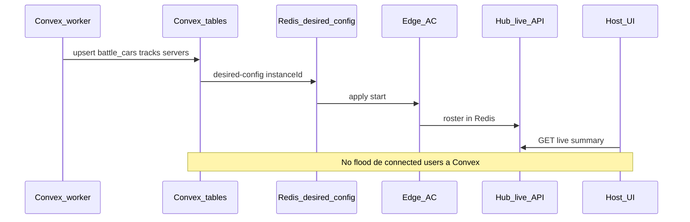

# Handoff web: Convex workers + Redis; hub ≈ live

Documento para el equipo **ProjectD Host**. Implementar en el repo web/BFF y Convex, **no** en `assetto-infra` salvo ops de ZIPs.

**Contratos hub** (este repo): [CONTROL_API_V1.md](../CONTROL_API_V1.md) (live), [SERVER_PLATFORM.md](../SERVER_PLATFORM.md) (allocate = fase 2), **[HOST_CATALOG_SYNC.md](../HOST_CATALOG_SYNC.md)** (hub → Convex cars/tracks/servers — SoT).

**ProjectD** (rutas en el repo Host, no en assetto-infra): `CONTROL_API_HOST_CUTOVER.md`, `PROJECTD_HOST_TEAM_HANDOFF.md`, `LIVE_INGEST_CUTOVER.md`, `convex/worker/hostCatalogSync.ts`, `convex/controlApiConfig.ts`, `convex/lib/configRefreshPush.ts`.

---

## Una frase

> Convex workers inyectan cars/tracks/servers (como los laps). Redis desired-config activa la instancia. La API del hub se usa sobre todo para **live players** — no reinyectéis a Convex la lista de conectados cada pocos segundos. Allocate / `server_slots` **no** es el happy path del Host.



---

## Qué vive dónde

| Dato | SoT / canal | La web hace |
|------|-------------|-------------|
| `battle_cars` / `battle_tracks` / `servers` / presets | Convex (worker o admin) | Queries Convex; alta vía worker secret (mismo estilo que ingest de tiempos) |
| Config activa (pista, coches, password) | Convex → Redis desired-config → edge | Start/stop como antes, por `servers.name` + `vps_hosts.instanceId` |
| ZIP en disco VPS | Hub `ensure` (ops) | Solo si falta content; no es el catálogo de Host |
| Jugadores conectados | Hub Redis live API | BFF → `GET /v1/servers/:lobby/live?instanceId=` y/o `GET /v1/live/summary` |
| Pool idle Postgres | Hub `server_slots` | **Aplazado** — no usar `allocate` en Host MVP |

Workers Convex (ProjectD): `convex/worker/hostCatalogSync.ts`.  
Hub sync env + mutation paths: **[HOST_CATALOG_SYNC.md](../HOST_CATALOG_SYNC.md)** (no duplicar aquí).

---

## Integración hub en ProjectD (flags)

| Flag | Env | Default |
|------|-----|---------|
| Live BFF | `CONTROL_API_URL` set | On cuando hay URL |
| Host ops (allocate, hub mod catalog) | `CONTROL_API_HOST_OPS=true` | **Off** |

Query ProjectD: `getHubIntegrationFlags` en `convex/controlApiConfig.ts`. Hooks: `useHubLiveEnabled`, `useHubHostOpsEnabled`.

---

## Convex workers (como los tiempos)

Implementar workers en ProjectD (`convex/worker/hostCatalogSync.ts`).  
Contrato, env hub y flujos cars/tracks/servers: **[HOST_CATALOG_SYNC.md](../HOST_CATALOG_SYNC.md)**.

**No** usar `GET /v1/mods` como catálogo de la web.

---

## Hub API: casi solo live (+ ensure disco)

Usar:

1. **Live** — BFF `GET /api/control/live/summary`, `GET /api/control/servers/:lobby/live?instanceId=`
2. **Ensure ZIP** — ops cuando falta content en VPS

No usar en MVP:

- Presence loop a Convex (`LIVE_INGEST_CONVEX=false` en edge; ver `LIVE_INGEST_CUTOVER.md` en ProjectD)
- `POST /v1/servers/allocate` como start obligatorio (salvo `CONTROL_API_HOST_OPS=true`)

Lobby name ≠ Convex `servers._id`. Pasar siempre `instanceId` (ej. `vps-eu-2`). Host deriva lobby de `servers.name` + `vpsInstanceId` en assignments.

---

## Flujo Host start (MVP)

1. Auth + preset en Convex.
2. `startHostSession` elige pool slot / cola / official.
3. `setPhysicalServerActive` → config refresh → Redis → edge.
4. Stop: `stopMyHostSession` (sin `server_slots`).

---

## Env web

```bash
CONTROL_API_URL=https://<hub-público>   # live + ensure
# CONTROL_API_HOST_OPS=true             # fase 2 allocate — off by default
CONVEX_WORKER_SECRET=…                  # workers; NUNCA NEXT_PUBLIC_
```

Browser: Next `/api/control/*` (live) + Convex client (catálogo/auth).

---

## Checklist equipo web

1. Catálogo cars/tracks/servers = Convex (queries + workers de alta).
2. Start = Convex + Redis desired-config, **sin** allocate (salvo `CONTROL_API_HOST_OPS`).
3. Connected players = hub live BFF; **no** tabla Convex de presence en loop (`LIVE_INGEST_CUTOVER.md` en ProjectD).
4. Live: lobby name + `instanceId`.
5. Ensure hub solo cuando falte ZIP en el VPS.
6. `no_idle_slot` no debería aparecer en MVP; si aparece, algo llama allocate por error.

---

## Fuera de alcance (fase 2 / ops)

- Bootstrap `server_slots` + Host allocate por región (`CONTROL_API_HOST_OPS=true`).
- Espejar idle/allocated/live en Convex.
- Volumen Dokploy `MOD_UPLOAD_ROOT` — ops infra.
