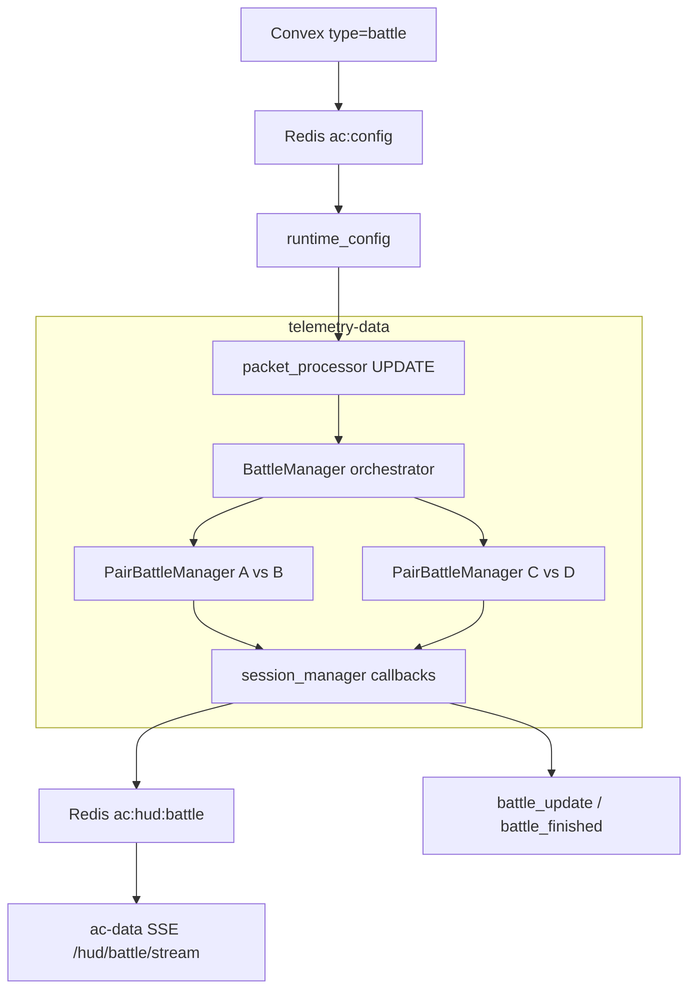

# Modo batallas (touge) — estado actual

Documentación del modo touge/batallas tal como está implementado en `telemetry-data`: activación por Convex, emparejamiento automático, máquina de estados por pareja, reglas de puntuación y eventos Redis.

## Activación del servidor

Una instancia de AC solo ejecuta lógica de batallas si su modo en la snapshot de Convex es `battle`:

- Convex → bridge Node (`ac-data`) → stream Redis `ac:config` → `core/runtime_config.py`
- En cada paquete de telemetría, `core/packet_processor.py` resuelve el modo y llama `battle_manager.set_server_mode(server_mode == "battle")`
- Si no hay snapshot Redis aún, el modo es `None` y **no hay batallas** hasta que llegue la config

## Arquitectura: muchas batallas 1v1 en paralelo

Con `BATTLE_HUD_ENABLED=true` (default), el estado en vivo se publica en Redis y **no** se envían líneas de batalla por chat ACSP. El overlay se suscribe con `EventSource` a `/hud/battle/stream` vía `ac-data`.

- `engines/battlesystem/orchestrator.py` (`BattleManager`): caché global de `CarState` por GUID, **matchmaking** y un `PairBattleManager` por pareja
- `engines/battlesystem/pair_manager.py` (`PairBattleManager`): máquina de estados de una batalla touge concreta
- Colisiones entre coches **no dan puntos** (`handle_collision` es no-op)

## Emparejamiento (matchmaking)

En cada `update()` de telemetría (`orchestrator._try_matchmake`):

1. Candidatos: activos en los últimos **3 s**, sin pareja asignada
2. Se emparejan si están a **≤ 15 m** (`BATTLE_ARM_MAX_GAP_METERS`) y ambos van a **> 40 km/h** (`BATTLE_ARM_MIN_SPEED_KMH`)
3. Algoritmo **greedy nearest-neighbor**: el par más cercano que cumple condiciones se bloquea primero; se repite hasta agotar candidatos
4. Un jugador solo puede estar en **una** batalla a la vez (`guid_to_pair`). Si la pareja queda separada en IDLE **10 s** (`BATTLE_PAIR_IDLE_SEPARATED_RELEASE_SEC`) o sin llegar a ACTIVE en **120 s** (`BATTLE_PAIR_MAX_PREACTIVE_LOCK_SEC`), el lock se disuelve y pueden emparejarse con otros

## Máquina de estados por pareja

Estados: `IDLE` → `ARMED` → `LAUNCHING` → `ACTIVE` → `FINISHED` (`engines/battlesystem/state_machine.py`)

| Estado | Qué ocurre |
|--------|------------|
| **IDLE** | Tras fin de sesión, vuelta a IDLE al siguiente tick. Si `can_arm` (≤`BATTLE_ARM_MAX_GAP_METERS`, ambos ≥`BATTLE_ARM_MIN_SPEED_KMH`) de forma **continua durante 5 s** → chat `X vs Y — BATTLE ARM 5…1 (brake: cancel \| continue: {gap}m / {speed}km/h)` → **ARMED** + "X vs Y — ARMED". Frenar o separarse → `X vs Y — BATTLE CANCELLED` |
| **ARMED** | Si se separan >80 m con ambos ≥20 km/h tras 2 s de gracia → abort sin punto. Si ambos ≥ umbral de armado → **LAUNCHING** + `X vs Y — GO — both over {speed} km/h`. Mensaje ARMED con cooldown 15 s para evitar spam. Se crea `battle_id` vía `on_battle_start` |
| **LAUNCHING** | Asigna lead/chase (spline o position fallback). **No** vuelve a exigir velocidad tras el GO. En position mode asigna en ~0.5 s; en spline espera hasta 6 s si no hay gap claro. Timeout 8 s solo si roles no se asignan → **ACTIVE** + "You are LEAD/CHASE" |
| **ACTIVE** | Puntuación en vivo (overtake, finish, abandon). Roles: **lead** adelante en spline, **chase** detrás |
| **FINISHED** | Cierra la sesión, libera la pareja y permite buscar rival nuevo inmediatamente. El rematch contra la misma pareja queda bloqueado por **`BATTLE_FINISHED_COOLDOWN_SEC`** (default 20 s) |

Constantes tunables en `engines/battlesystem/config.py` (variables de entorno con prefijo `BATTLE_` / `OVERTAKE_`).

**Anti-spam / camping:** la proximidad sostenida antes de ARMED evita batallas por rozar a otro piloto en una zona. Complementa el abandono a 0-0 con progreso &lt; 10 % (`BATTLE_ABANDON_MIN_PROGRESS_FOR_WIN`), que cancela la sesión si alguien se aleja sin haber corrido de verdad.

### Mapas sin spline (touge sin `fast_lane.ai`)

Si el servidor AC no reporta `NormalizedPosition` válido (spline ≈ 0 o congelado), el armado por gap 3D sigue funcionando, pero overtake/roles/progreso por spline fallan. En ese caso:

- Se activa **position mode** (chat: `BATTLE — position mode (track spline unavailable)`).
- Si `NormalizedPosition` es 0 o no fiable al pasar a ACTIVE, se fuerza position mode aunque el flag aún diga `spline_reliable=True`.
- Lead/chase, overtake y abandon usan **posición 3D + velocidad** (o delta de posición si AC no manda velocidad) en lugar de spline.
- Overtake en fallback: gap **10 m – max(20 m, BATTLE_ARM_MAX_GAP_METERS)**; delante/atras con `BATTLE_POSITION_AHEAD_MIN_METERS` (no el margen spline 0.0003).
- Progreso de abandono 0-0 usa **metros recorridos** (`BATTLE_ABANDON_MIN_PROGRESS_METERS`, default 200 m).
- Overtake en fallback permite gap hasta **20 m** (`BATTLE_OVERTAKE_MAX_GAP_FALLBACK_METERS`).
- Fin de vuelta depende de **ACSP `LAP_COMPLETED`** (no del cruce spline 0.90→0.10).

Recomendación: instalar `content/tracks/&lt;track&gt;/ai/fast_lane.ai` en el servidor para spline nativo.

## Cómo se puntúa

### Durante ACTIVE

1. **Overtake (+1 al chase)** — `engines/battlesystem/rules/overtake.py`
   - Tras **2 s** de gracia al entrar en ACTIVE
   - Cooldown **2 s** entre puntos de adelantamiento
   - Solo si distancia **10–15 m** (o hasta **20 m** en position mode)
   - Chase adelanta al lead en spline o, en position mode, por proyección 3D

2. **Position recovery (+1 al lead)** — tras un overtake del chase, si el lead recupera posición adelante

3. **Abandon por parada / pits (cualquier distancia)** — `check_abandon_by_stall` (antes del gap check)
   - Rival &lt; `BATTLE_GAP_ABORT_MIN_BOTH_SPEED_KMH` durante **`BATTLE_ABANDON_STALL_SEC`** (default 5 s) y tú sigues en movimiento → fin inmediato (`opponent_stalled`)
   - No hace falta alejarse 200 m si el otro entra a boxes al inicio
   - **0-0** con poco progreso → `CANCELLED (opponent stopped)`; con puntos → victoria

4. **Abandon por separación en pista (≥ `BATTLE_DISAPPEAR_GAP_METERS`)** — `check_abandon_by_gap`
   - Solo cuando el gap 3D ya es grande (ej. 200 m en tu `.env.local`)
   - Ambos en movimiento → gana quien va **adelante en pista**; empate en spline → más progreso
   - Parado a 200 m+ sigue resolviendo igual que antes
   - **0-0** con progreso ≥ 10 % vuelta → victoria; sin progreso → cancelación

### Fin de vuelta (lead completa una vuelta)

- La batalla puede empezar **en cualquier punto** del circuito; el fin no es “100 % del mapa desde el spline 0”
- Cuenta cuando el **lead cruza la línea de meta**:
  - evento ACSP `LAP_COMPLETED`, o
  - cruce de spline (≥0.90 → ≤0.10) tras haber recorrido al menos **30 %** del trazado desde el GO (`BATTLE_MIN_LAP_PROGRESS_BEFORE_FINISH`)
- Al completar la vuelta:
  - Gap final **≥ 20 m** y claramente adelante en pista → **+1 finish** (`finish_outrun`) al que va adelante
  - Gap **< 20 m** o empate en pista → **empate**, sin punto de finish
- Ganador de sesión / Convex: mayor marcador tras el finish (no el rol lead fijo)
- Chat: `FINISH — WIN …` o `FINISH — DRAW …` (marcador en el mensaje)

### Desconexión / inactividad

- Disconnect en ARMED/LAUNCHING/ACTIVE → intenta `_finalize_abandon` al que queda
- Telemetría stale >20 s o jugador inactivo >5 s → cancel o abandon según estado y marcador

## Feedback al jugador

- Con **`BATTLE_HUD_ENABLED=true`** (default): estado en vivo en Redis (`network/battle_hud_publisher.py`) → SSE `/hud/battle/stream` en `ac-data`. Sin chat de batalla.
- Con `BATTLE_HUD_ENABLED=false`: mensajes in-game vía `handle_chat_message` → `send_chat` (`engines/battlesystem/chat.py`).

## Persistencia / backend

- Al pasar a **ARMED**, se genera `battle-{uuid12}` (`handle_battle_start` en `session_manager.py`)
- **HUD en vivo** (cada transición / punto): claves Redis `ac:hud:battle:{serverKey}:{steamId}` y `ac:hud:ver:battle:*` (`network/battle_hud_publisher.py`). Snapshots de fin/cancel incluyen `cancelReason`, `endReason`, `endLabel`, `lastEvent`; se borran tras `HUD_BATTLE_CLEAR_DELAY_SEC` (default 5 s).
- **Al terminar** sesión con ganador o empate: además `battle_update` + `battle_finished` en stream `ac:events` (`network/event_dispatcher.py`)

Ver también [REDIS_CONTRACT.md](../REDIS_CONTRACT.md) para el esquema de eventos.

## Qué NO hace el modo batalla

- No publica `lap_completed` / `lapTime` a Redis ni Convex (solo time-attack)
- El paquete ACSP `LAP_COMPLETED` solo marca fin de run touge vía `BattleManager.handle_lap_completed`
- No usa vueltas cronometradas del modo time-attack
- No puntúa colisiones coches-coches
- No escribe `server_cfg.ini` (lo hace `ac-data` desde Convex)
- No funciona sin modo `battle` en la snapshot de config

## Archivos clave

| Rol | Archivo |
|-----|---------|
| Orquestación multi-pareja | `engines/battlesystem/orchestrator.py` |
| Estado 1v1 | `engines/battlesystem/state_machine.py` |
| Umbrales | `engines/battlesystem/config.py` |
| Integración AC | `core/packet_processor.py` |
| HUD batalla → Redis | `network/battle_hud_publisher.py` |
| Tests reglas | `tests/battlesystem/` |

## Referencia rápida de umbrales

| Regla | Umbral (default) | Variable de entorno |
|-------|------------------|---------------------|
| Arm / pair lock | ≤ 15 m, ambos > 40 km/h | `BATTLE_ARM_MAX_GAP_METERS`, `BATTLE_ARM_MIN_SPEED_KMH` |
| Arm (IDLE → ARMED) | condiciones sostenidas 5 s | `BATTLE_ARM_SUSTAINED_PROXIMITY_SEC` |
| Rematch tras fin/cancel | cooldown 20 s solo para la misma pareja | `BATTLE_FINISHED_COOLDOWN_SEC` |
| Abort prestart (solo ARMED) | > 80 m, ambos ≥ 20 km/h tras 2 s | `MAX_BATTLE_GAP_METERS`, `BATTLE_PRESTART_GAP_ABORT_GRACE_SEC` |
| Overtake / recovery | gap 10–15 m | `OVERTAKE_MIN_GAP_METERS`, `OVERTAKE_MAX_GAP_METERS` |
| Finish | lead completa vuelta (meta) + gap ≥ 20 m | `BATTLE_FINISH_LINE_*`, `BATTLE_MIN_LAP_PROGRESS_BEFORE_FINISH`, `BATTLE_FINISH_POINT_MIN_GAP_METERS` |
| Abandon (pits / parado) | &lt; 20 km/h durante 5 s, sin mínimo de metros | `BATTLE_ABANDON_STALL_SEC`, `BATTLE_GAP_ABORT_MIN_BOTH_SPEED_KMH` |
| Abandon (separación en pista) | gap ≥ 200 m (tu env) | `BATTLE_DISAPPEAR_GAP_METERS` |
| Abandon win at 0-0 | max `driven_spline` ≥ 10 % vuelta | `BATTLE_ABANDON_MIN_PROGRESS_FOR_WIN` |
| Abandon win at 0-0 (position mode) | max `driven_distance_m` ≥ 200 m | `BATTLE_ABANDON_MIN_PROGRESS_METERS` |
| Spline stuck detection | 2 s moviendo sin Δspline, velocidad ≥ min(25, arm speed) | `BATTLE_SPLINE_STUCK_*` |
| Launch roles (position mode) | asigna en ~0.5 s | `BATTLE_POSITION_ROLE_ASSIGN_WAIT_SEC` |
| Overtake fallback max gap | 20 m | `BATTLE_OVERTAKE_MAX_GAP_FALLBACK_METERS` |
