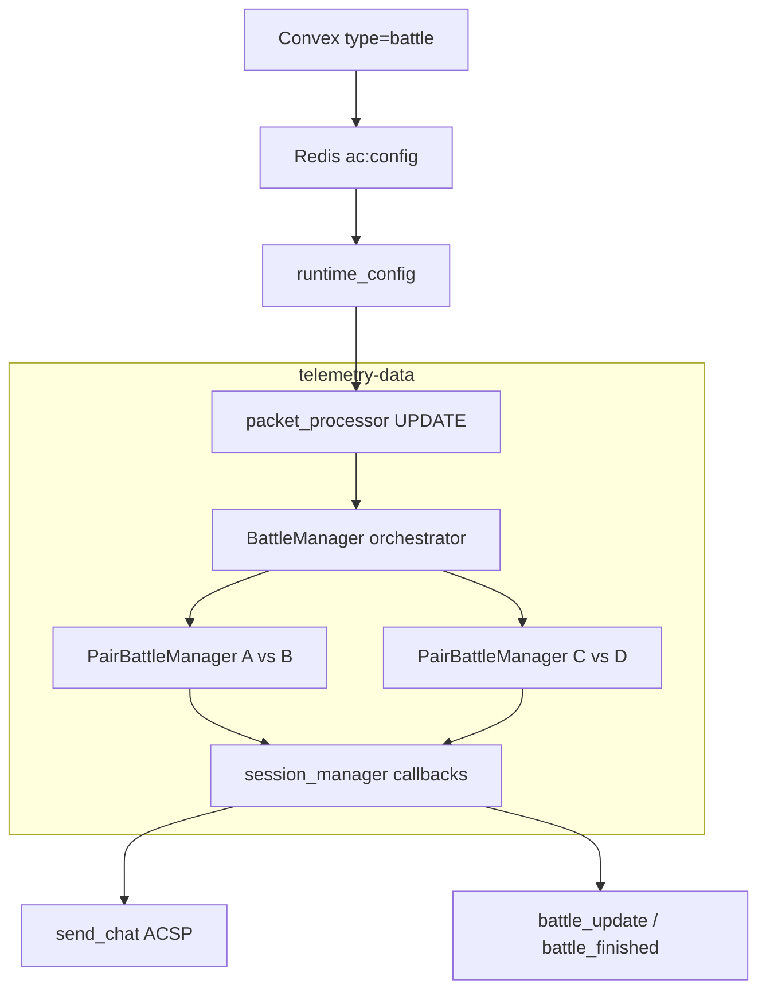

# Modo batallas (touge) — estado actual

Documentación del modo touge/batallas tal como está implementado en `telemetry-data`: activación por Convex, emparejamiento automático, máquina de estados por pareja, reglas de puntuación y eventos Redis.

## Activación del servidor

Una instancia de AC solo ejecuta lógica de batallas si su modo en la snapshot de Convex es `battle`:

- Convex → bridge Node (`ac-data`) → stream Redis `ac:config` → `core/runtime_config.py`
- En cada paquete de telemetría, `core/packet_processor.py` resuelve el modo y llama `battle_manager.set_server_mode(server_mode == "battle")`
- Si no hay snapshot Redis aún, el modo es `None` y **no hay batallas** hasta que llegue la config

## Arquitectura: muchas batallas 1v1 en paralelo

- `engines/battlesystem/orchestrator.py` (`BattleManager`): caché global de `CarState` por GUID, **matchmaking** y un `PairBattleManager` por pareja
- `engines/battlesystem/pair_manager.py` (`PairBattleManager`): máquina de estados de una batalla touge concreta
- Colisiones entre coches **no dan puntos** (`handle_collision` es no-op)

## Emparejamiento (matchmaking)

En cada `update()` de telemetría (`orchestrator._try_matchmake`):

1. Candidatos: activos en los últimos **3 s**, sin pareja asignada
2. Se emparejan si están a **≤ 15 m** (`BATTLE_ARM_MAX_GAP_METERS`) y ambos van a **> 40 km/h** (`BATTLE_ARM_MIN_SPEED_KMH`)
3. Algoritmo **greedy nearest-neighbor**: el par más cercano que cumple condiciones se bloquea primero; se repite hasta agotar candidatos
4. Un jugador solo puede estar en **una** batalla a la vez (`guid_to_pair`)

## Máquina de estados por pareja

Estados: `IDLE` → `ARMED` → `LAUNCHING` → `ACTIVE` → `FINISHED` (`engines/battlesystem/state_machine.py`)

| Estado | Qué ocurre |
|--------|------------|
| **IDLE** | Tras fin de sesión, vuelta a IDLE al siguiente tick. Si `can_arm` (≤15 m, ambos >40 km/h) de forma **continua durante 5 s** → chat `BATTLE ARM 5…1 (brake: cancel \| continue: 15m / 40km/h)` → **ARMED** + "X vs Y — ARMED". Frenar o separarse → `BATTLE CANCELLED` |
| **ARMED** | Si se separan >80 m con ambos ≥20 km/h tras 2 s de gracia → abort sin punto. Si ambos ≥40 km/h → **LAUNCHING** + "GO — both over 40 km/h". Mensaje ARMED con cooldown 15 s para evitar spam. Se crea `battle_id` vía `on_battle_start` |
| **LAUNCHING** | Espera roles lead/chase en spline (hasta 6 s); si no hay gap claro, asigna por posición igualmente. No aborta por abrir gap tras el GO. Timeout 8 s si bajan de 40 km/h → **ACTIVE** + "You are LEAD/CHASE" |
| **ACTIVE** | Puntuación en vivo (overtake, finish, abandon). Roles: **lead** adelante en spline, **chase** detrás |
| **FINISHED** | Un tick de telemetría, luego reset a IDLE (marcador reiniciado) para nueva batalla con la misma pareja |

Constantes tunables en `engines/battlesystem/config.py` (variables de entorno con prefijo `BATTLE_` / `OVERTAKE_`).

**Anti-spam / camping:** la proximidad sostenida antes de ARMED evita batallas por rozar a otro piloto en una zona. Complementa el abandono a 0-0 con progreso &lt; 10 % (`BATTLE_ABANDON_MIN_PROGRESS_FOR_WIN`), que cancela la sesión si alguien se aleja sin haber corrido de verdad.

## Cómo se puntúa

### Durante ACTIVE

1. **Overtake (+1 al chase)** — `engines/battlesystem/rules/overtake.py`
   - Tras **2 s** de gracia al entrar en ACTIVE
   - Cooldown **2 s** entre puntos de adelantamiento
   - Solo si distancia **10–15 m** (paso claro, misma batalla)
   - Chase pasa al lead en spline (margen `0.0003` en loop de pista)

2. **Position recovery (+1 al lead)** — tras un overtake del chase, si el lead recupera posición adelante

3. **Abandon por separación (≥250 m)** — `engines/battlesystem/rules/finish.py` (`check_abandon_by_gap`)
   - Parado / muy lento → abandona ese piloto; gana quien sigue en pista
   - Si ambos en movimiento → gana quien va **adelante en pista** (el de atrás “desapareció” del duelo); empate en spline → más `driven_spline`
   - Si ya hubo puntos en el marcador → victoria al no-abandonador
   - Si **0-0** y la pareja recorrió al menos **10 %** de vuelta desde el GO (`max(driven_spline)` ≥ `BATTLE_ABANDON_MIN_PROGRESS_FOR_WIN`) → victoria al ganador candidato (quien iba adelante / más progreso)
   - Si **0-0** y progreso &lt; 10 % (separación casi al instante) → cancelación sin ganador

### Fin de vuelta (lead completa una vuelta)

- La batalla puede empezar **en cualquier punto** del circuito; el fin no es “100 % del mapa desde el spline 0”
- Cuenta cuando el **lead cruza la línea de meta**:
  - evento ACSP `LAP_COMPLETED`, o
  - cruce de spline (≥0.90 → ≤0.10) tras haber recorrido al menos **30 %** del trazado desde el GO (`BATTLE_MIN_LAP_PROGRESS_BEFORE_FINISH`)
- Al completar la vuelta:
  - Gap final **≥ 20 m** y claramente adelante en pista → **+1 finish** (`finish_outrun`) al que va adelante
  - Gap **< 20 m** o empate en pista → **empate**, sin punto de finish
- Ganador de sesión / Convex: mayor marcador tras el finish (no el rol lead fijo)
- Chat: `FINISH — WIN …` o `FINISH — DRAW …` (marcador en el mensaje)

### Desconexión / inactividad

- Disconnect en ARMED/LAUNCHING/ACTIVE → intenta `_finalize_abandon` al que queda
- Telemetría stale >20 s o jugador inactivo >5 s → cancel o abandon según estado y marcador

## Feedback al jugador

- Mensajes **privados in-game** vía `handle_chat_message` → `send_chat` por `car_id` (`core/session_manager.py`)
- Formato de puntos: `OVERTAKE +1`, `RECOVER +1`, `FINISH +1`, marcador `NombreA 2 : NombreB 1`, etc. (`engines/battlesystem/chat.py`)

## Persistencia / backend

- Al pasar a **ARMED**, se genera `battle-{uuid12}` (`handle_battle_start` en `session_manager.py`)
- **Solo al terminar** una sesión con `winner_guid` definido se publica Redis:
  - `battle_update` + `battle_finished` con scores, `pointsLog`, track, coches (`network/event_dispatcher.py`)
- No hay updates intermedios por cada punto; el webhook es al cierre de la serie/sesión

Ver también [REDIS_CONTRACT.md](../REDIS_CONTRACT.md) para el esquema de eventos.

## Qué NO hace el modo batalla

- No publica `lap_completed` / `lapTime` a Redis ni Convex (solo time-attack)
- El paquete ACSP `LAP_COMPLETED` solo marca fin de run touge vía `BattleManager.handle_lap_completed`
- No usa vueltas cronometradas del modo time-attack
- No puntúa colisiones coches-coches
- No escribe `server_cfg.ini` (lo hace `ac-data` desde Convex)
- No funciona sin modo `battle` en la snapshot de config

## Archivos clave

| Rol | Archivo |
|-----|---------|
| Orquestación multi-pareja | `engines/battlesystem/orchestrator.py` |
| Estado 1v1 | `engines/battlesystem/state_machine.py` |
| Umbrales | `engines/battlesystem/config.py` |
| Integración AC | `core/packet_processor.py` |
| Tests reglas | `tests/battlesystem/` |

## Referencia rápida de umbrales

| Regla | Umbral (default) | Variable de entorno |
|-------|------------------|---------------------|
| Arm / pair lock | ≤ 15 m, ambos > 40 km/h | `BATTLE_ARM_MAX_GAP_METERS`, `BATTLE_ARM_MIN_SPEED_KMH` |
| Arm (IDLE → ARMED) | condiciones sostenidas 5 s | `BATTLE_ARM_SUSTAINED_PROXIMITY_SEC` |
| Abort prestart (solo ARMED) | > 80 m, ambos ≥ 20 km/h tras 2 s | `MAX_BATTLE_GAP_METERS`, `BATTLE_PRESTART_GAP_ABORT_GRACE_SEC` |
| Overtake / recovery | gap 10–15 m | `OVERTAKE_MIN_GAP_METERS`, `OVERTAKE_MAX_GAP_METERS` |
| Finish | lead completa vuelta (meta) + gap ≥ 20 m | `BATTLE_FINISH_LINE_*`, `BATTLE_MIN_LAP_PROGRESS_BEFORE_FINISH`, `BATTLE_FINISH_POINT_MIN_GAP_METERS` |
| Abandon | gap ≥ 250 m | `BATTLE_DISAPPEAR_GAP_METERS` |
| Abandon win at 0-0 | max `driven_spline` ≥ 10 % vuelta | `BATTLE_ABANDON_MIN_PROGRESS_FOR_WIN` |
